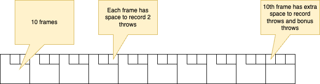
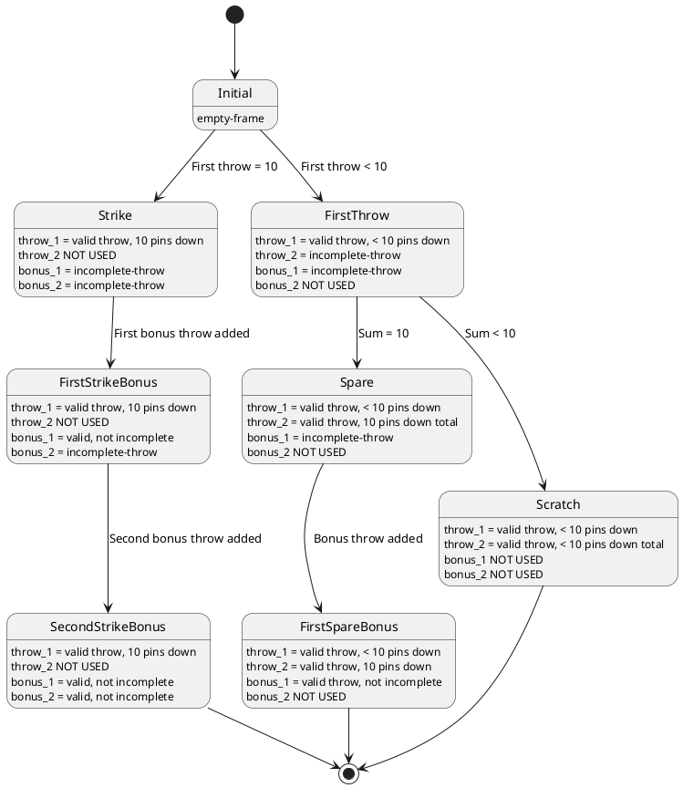

# The Bowling Game: An Example of Equational Theory Development

**Engineer's Notebook: An Equational Thinking Episode**

> "The person who says he knows what he thinks but cannot express it usually does not know what he thinks."
>
>   ― Mortimer J. Adler, How to Read a Book: The Classic Guide to Intelligent Reading

## Introduction

In 2000 Robert "Uncle Bob" Martin published [_The Bowling Game: An example of test-first pair programming_](https://sites.google.com/site/unclebobconsultingllc/uncle-bob-consulting-llc/articles/the-bowling-game-an-example-of-test-first-pair-programming?authuser=0),
memorializing a TDD pair-programming session between Bob Koss and Bob Martin, during which the Bobs endeavor to
implement a set of Java classes were that combine to score a game of bowling.

Distinctly missing from the narrative: any actual definition of "the game of bowling". Here's Bob Martin's description
of what they set out to build, which is the best indication of what they were trying to accomplish:

> RCM: "It seems to me that the inputs are simply a sequence of throws. A throw is just an integer that tells how
> many pins were knocked down by the ball. The output is the data on a ***standard bowling score card***, a set of frames
> populated with the pins knocked down by each throw, and marks denoting spares and strikes. The most important
> number in each frame is the current game score." _[Emphasis mine]_

What's missing is any "standard" that the solution can be verified against. In effect what the Bobs end up doing is defining their own axiomatic standard -- their code _is_ the standard, so of course it does what it is supposed
to do. Does it correctly score the definition of "the game of bowling" that the Bobs were trying to implement?
We don't know. Neither actor produces a definition of "bowling". Bob Martin refers to _"a standard bowling score
card"_, but fails to reference an actual standard that he is working from.

What's missing is a logical definition of the bowling standard that Bob alludes to. Armed with such a tool, the
development process in the narrative would have gone more smoothly and quickly, and it would have produced a
provably correct (or provably incorrect) final software package. I imagine they also would have identified possible
failures of the software they produced (described below).

Instead of a provably correct result, what the Bobs produced is software that self-asserts to conform to _some_ standard,
implemented internally by a set of inter-reliant Java classes. Most of the narrative concerns incremental development
of the Java classes. The reader follows the internal intricacies and nitty-gritty of the Bobs' domain and problem space
exploration with interest, but after all is said and done the reader cannot ratify or deny the assertion "a conforming
implementation of the bowling score algorithm has been produced".

As with most produced software, there's no way to determine whether the final product actually fulfills its
specification, because the specification is imprecise, collectively assumed, or perhaps never really existed in the
first place. There's no way to verify that such software conforms with the standard it is intended to
implement.

And like many software projects, this one ends at the terminus of exhaustion rather than at the provable completion of
its stated task. Such projects end when the stakeholders are exhausted of resources, and someone with adequate
authority can persuasively argue that the project is complete. In this case, the Bobs and the reader stand in for
stakeholders, and the resource that is exhausted is creative imagination (and attention span). The end of the
narrative expresses this state:

> RSK: "That pretty much covers it. Can you think of any more meaningful test cases?"
>
> RCM: "No, I think that's the set. There aren't any there that I'd be comfortable removing at this point."
> 
> RSK: "Then we're done."
> 
> RCM: "I'd say so. Thanks a lot for you help."
>
> RSK: "No problem, it was fun."

A much more convincing TDD episode would have started with a logical, objectively provable definition of
the target algorithm, and incrementally developed a Java implementation with individual test cases proven to meet the
standard.

In this article I will develop a definition of "bowling". That is, a definition of the standard against which any integer
sequence reduce function can be applied to verify the function agrees with the standard [^1]. I will use the smtlib2
language and follow the techniques I describe in the companion article [_"OSM specs in smtlib2"_](../../osm-specs-in-smtlib2.html).

### The Bowling Score Card Standard

The governing body for bowling in the US is the United States Bowling Congress ([USBC](https://bowl.com)). This
organization publishes [a standard for scoring a game of bowling](./assets/ScoreHowto.2024-11-11.pdf), which somewhat
matches the Bobs' internal understanding of the game, with some key differences:

1. The official version does not support the concept of an _incomplete_ game. A game consists of all necessary
  throws [^2] to complete 10 frames: up to 2 throws plus up to two bonus throws forms a frame. The bonus throws for frame
  `N` are synonymous with the normal throws of the `N+1`-th frame. Legal games can be produced from as few as 12 throws
  (12 consecutive strikes), and as many as 21 throws (any sequence of 21 throws that includes no strikes).

1. In the official version of bowling, a throw cannot be represented by a single integer. In the TDD narrative,
  Robert Koss and Bob Martin quickly convince themselves, incorrectly, that a single integer is sufficient to store
  the information of throw. Here's Bob Martin's words from above, again repeated to show where the unchallenged
  assertion is made very early in the narrative:

    > RCM: "It seems to me that the inputs are simply a sequence of throws. A throw is just an integer that tells how
    > many pins were knocked down by the ball. The output is the data on a standard bowling score card, a set of frames
    > populated with the pins knocked down by each throw, and marks denoting spares and strikes. The most important
    > number in each frame is the current game score."

    Again a little later, the assumption is reinforced:

    > RSK: "Do you have a clue what the behavior of a Throw object should be?"
    >
    > RCM: "It holds the number of pins knocked down by the player."

    The USBC standard supports a legal throw, for which the number of pins knocked down would be a valid
    representation. The standard also says that a throw may be a _foul_, recorded on the score card with the letter
    "F", and adding no pins the the accumulate score. The Bobs' model is inadequate to produce a score card for all
    valid bowling games, because some valid games include fouls.

    This may seem like persnickety special-casery, and perhaps it is, but it is evidence that the Bobs' were
    not developing any objectively provable implementation of a standard, but instead were simply encoding a
    subjectively-derived psuedostandard. This will be the case with all software developed without an objectively
    verifiable logical model -- today this includes virtually _all software_. There is no practice of developing
    software to meet a mechanically verifiable model.


3. The official version supports, though does not require, a "split" significator associated with the first throw
   in a frame. This is a special demarcation indicating the remaining upright pins after a first throw are in
   a configuration that meets a specific "split" rule. A split is basically a configuration of pins that can be
   particularly difficult to knock down in the frame's second throw.

The TDD narrative's technique for developing a test suite, by constructing partially-complete games and testing
the state of those games, coincidentally mimics the way that the USBC official scoring standard is written. This is
a constructivist pattern, describing how to incrementally accumulate a single throw into a game in progress. The
standard also implies a terminal condition which ends the process, producing a completed game. The constructivist
description ensures that if you apply the incremental accumulation rules to a sufficient number of throws, you will
end up with a valid, completed game.

In the TDD narrative, most of the Bobs' test cases score incomplete games -- games in progress. We can see Bob
Martin briefly wrestle with the issue of game incompleteness at one point:

> RSK: "Hmmmm... if we call add(10) to represent a strike, what should getScore return? I don't know how to write
> the assertion, so maybe we're asking the wrong question. Or we're asking the right question to the wrong object."
>
> RCM: "When you call add(10), or add(3) followed by add(7), then calling getScore on the Frame is meaningless. The
> frame would have to look ahead at later frames to calculate its score. If those later frames don't exist, then it
> would have to return something ugly like -1. I don't want to return -1."

The USBC standard does not specify the "value" of an incomplete frame or an incomplete game, either. I would argue
the Bobs were chasing an illusion -- there is no correct nor incorrect value for an incomplete frame according to any
standard. Any assertion about the "correct" value is perfectly undecidable. The entire question of whether or not
the Bobs' bowling implementation conforms to any standard is also perfectly undecidable.

## Developing Equations for a bowling score card

The missing piece in Bob Martin's TDD narrative is a verifiable logic model. Armed with such a model, any input
and any output, even intermediate state output, can be verified to be in or out of compliance using an automated
logic solver. SMTLIB2 is a capable language for logic modeling, readily understandable to software professionals
because it is very Lisp-like. Several logic solvers exist that accept smtlib2 models, such as [Microsoft's Z3](https://github.com/Z3Prover/z3/wiki),
[CVC5](http://cs.nyu.edu/acsys/cvc5/), and several [others](https://smt-lib.org/solvers.shtml).

Let's start by reviewing a bowling score card, and develop a logical model of a bowling game from it.



The score card reflects how the game of bowling structured: there are 10 "frames", or what might be called "turns" in
other games. A player scores from 0-30 points in each frame. The score card represents each frame in the game as
one of 10 squares, read from left to right.

In the square for each frame we traditionally write the _accumlated total points_ (the sum of points in all
previous frames plus the points scored in the current frame) rather than the points scored in each frame individually.
This is a convention, arising from the fact that game used to be scored manually. The final game score is the
same whether we score each frame individually and sum at the end or accumulate as the game progresses.

There are areas towards the top of each frame's square for representing the 1 or 2 normal throws that are part of each
frame. Each frame's score also includes the value of 0, 1 or 2 additional bonus throws [^3]. The standard score card
does not represent the bonus throws, as the bonus throws in one frame are synonymous with the normal throws of the
subsequent frame. This is true for all frames except the 10th. The 10th frame has no subsequent, so the 10th frame
does have extra space to represent its bonus throws.

The rules and traditions for where and how to display each throw in a frame, as well as the tradition of displaying a
running sum, are _visualization_ rules. The formal logical model we now develop is easily transformed into this
kind of representation, but the model is actually a bit simpler. We will define the model of a "game in progress"
-- a more relaxed model than a "completed game" model, allowing for incompleted frames.

### Representing a Throw

Let's begin with the simplest concept: a single throw. Primarily we would want to represent a set of pins knocked down. We
could either represent this as an integer value (the total number of pins knocked down), or a bitvector of width 10 representing the
standing-up/knocked-down state of each individual pin [^4].

There is a very good reason to choose bitvector over integer: SMT solvers don't deal wonderfully with inifinite value ranges, and
integer is an infinitely-valued type, while bitvector is not. SMT solvers are great at deducing from first principals, but they aren't great
at exploring bespoke value ranges, such as "the infinite set of integers, where the values between 0-10 are treated differently than
the rest of the range", especially if the range disjuncture boundaries get obscured in multiple levels of logic.

The general rule I've learned with SMT solvers: always opt for a finite-valued type when you can. When the SMT solver has to
consider complicated, bespoke rules (like the rules of a game of bowling), it can always decide to "brute force" a proof by trying
all possible values in a range, or all possible branches in a logic tree. But if the range is infinite, then it has to rely
on hueristics and deduction from first principals only, which can lead to infinite loops, exploration of very sparsely populated
ranges, and other problems that lead a proof engine astray.

I will use a bit value "0" to represent a standing pin, and "1" to represent a knocked-down pin.

File "throw.smt2"
```
(declare-datatype Throw (
    (throw
      (pins (_ BitVec 10)))))
```

> **Note**: the syntax `(_ BitVec 10)` means "a bitvector of width 10". smtib2 has a convenience representation for static bitvector
> values: `#b0011001011` -- this is a 10-bit wide bitvector with values "0011001011" for the 10 bits, respectively. There are also
> a bunch of bitvector operators available: `bvand`, `bvor`, and other bit-by-bit operators; `bv2nat` to convert a bitvector to a binary
> numeric value; `zero-extend` and `extract` round out the operators we will need to convert a bitvector to a count of fallen pins.

There are 2 functions I know I'm going to be writing, and I will want to start throwing down test-cases [^5] that rely on  the behavior of these
functions soon.

- `throw.points`: a function computing the point score of any throw. This is just the count of "1" bits in the bitvector.
- `throw.valid`: a predicate differentiating valid throws from invalid ones. The way it is written now, I don't think an invalid
  instance of `Throw` exists, but I'm going to need to add foul throws and incomplete throws shortly. Validation will be necessary,
  so best to get the scaffolding of that down.

File "test-case.throw.validation.throw.points-fun.smt2":
```
#include "throw.smt2"

(define-const test-data.throw.all-zeros      Throw (throw #b0000000000))
(define-const test-data.throw.all-ones       Throw (throw #b1111111111))
(define-const test-data.throw.all-but-lsb-0  Throw (throw #b0000000001))
(define-const test-data.throw.all-but-lsb-1  Throw (throw #b1111111110))
(define-const test-data.throw.all-but-msb-0  Throw (throw #b1000000000))
(define-const test-data.throw.all-but-msb-1  Throw (throw #b0111111111))
(define-const test-data.throw.lower-half-0   Throw (throw #b1111100000))
(define-const test-data.throw.upper-half-0   Throw (throw #b0000011111))
(define-const test-data.throw.alt-bits-0     Throw (throw #b1010101010))
(define-const test-data.throw.alt-bits-1     Throw (throw #b0101010101))
(define-const test-data.throw.random-dense   Throw (throw #b1101110111))
(define-const test-data.throw.random-sparse  Throw (throw #b0001001010))

;; prove all these throws are valid
(assert
  (and
    (throw.valid test-data.throw.all-zeros)
    (throw.valid test-data.throw.all-ones)
    (throw.valid test-data.throw.all-but-lsb-0)
    (throw.valid test-data.throw.all-but-lsb-1)
    (throw.valid test-data.throw.all-but-msb-0)
    (throw.valid test-data.throw.all-but-msb-1)
    (throw.valid test-data.throw.lower-half-0)
    (throw.valid test-data.throw.upper-half-0)
    (throw.valid test-data.throw.alt-bits-0)
    (throw.valid test-data.throw.alt-bits-1)
    (throw.valid test-data.throw.random-dense)
    (throw.valid test-data.throw.random-sparse)))

;; prove throw.points function computes expected value for all cases 
(assert
  (and
    (= (throw.points test-data.throw.all-zeros) 0)
    (= (throw.points test-data.throw.all-ones) 10)
    (= (throw.points test-data.throw.all-but-lsb-0) 1)
    (= (throw.points test-data.throw.all-but-lsb-1) 9)
    (= (throw.points test-data.throw.all-but-msb-0) 1)
    (= (throw.points test-data.throw.all-but-msb-1) 9)
    (= (throw.points test-data.throw.lower-half-0) 5)
    (= (throw.points test-data.throw.upper-half-0) 5)
    (= (throw.points test-data.throw.alt-bits-0) 5)
    (= (throw.points test-data.throw.alt-bits-1) 5)
    (= (throw.points test-data.throw.random-dense) 8)
    (= (throw.points test-data.throw.random-sparse) 3)
    (= (throw.points foul-throw) 0)
    (= (throw.points unused-throw) 0)
    (= (throw.points incomplete-throw) 0)))

(check-sat)
```

The `throw.valid` predicate is trivial at this point, since there are no invalid throws.

The `throw.points` function counts the number of "1" bits in the throw's bitvector. Honestly this would be a
challenge for me as my smtlib2-fu isn't top grade, but my AI sidecar assistant helped me whip it out pretty quickly.
The details aren't important so long as the test-cases can be proven. The curious reader can look at the comments in the source
code, which explains how this function works.

From file `throw.smt2`
```
(define-fun throw.valid ((t Throw)) Bool
  true)

(define-fun throw.points ((t Throw)) Int
  (bv2nat
    (bvadd
      ((_ zero_extend 3) ((_ extract 0 0) (pins t)))
      ((_ zero_extend 3) ((_ extract 1 1) (pins t)))
      ((_ zero_extend 3) ((_ extract 2 2) (pins t)))
      ((_ zero_extend 3) ((_ extract 3 3) (pins t)))
      ((_ zero_extend 3) ((_ extract 4 4) (pins t)))
      ((_ zero_extend 3) ((_ extract 5 5) (pins t)))
      ((_ zero_extend 3) ((_ extract 6 6) (pins t)))
      ((_ zero_extend 3) ((_ extract 7 7) (pins t)))
      ((_ zero_extend 3) ((_ extract 8 8) (pins t)))
      ((_ zero_extend 3) ((_ extract 9 9) (pins t))))))
```

The test cases are provable: the response to the test's `(check-sat)` directive is `sat`.

### Foul throws

There are a couple ways to represent foul throws vs legal throws. One is to use an algebraic constant, and the other is to just use a boolean field, with a constant value we can use to represent all foul throws.

```
;; Algebraic constant option
(declare-datatype Throw (
    foul                   ;; <-- "foul" is a distinct Throw instance
    (throw
      (pins (_ BitVec 10)))))

;; Boolean field option
(declare-datatype Throw (
    (throw
      (pins (_ BitVec 10))
      (foul Bool))))       ;; every throw has a boolean foul flag

;; a single "foul" throw instance
(declare-const foul-throw Throw
  (throw
    #b0000000000  ;; no pins knocked down
    true))        ;; foul flag is true
```

This is a stylistic choice. I'm going with the boolean `foul` field and separate `foul-throw` constant. This just seems
simpler to me.

I need test-cases to show that:

- the `foul-throw` is valid
- any valid throw that knocks any pins down cannot be a foul throw

Test-case in file "test-case.throw.validation.foul-throw.smt2"
```
(assert (! (not (exists ((t Throw))
  (and
    (foul t)
    (throw.valid t)
    (not (= #b0000000000 (pins t)))))
)) :named test-case.throw.valid.foul-throw))

(check-sat)
```

- I like writing tests using the "there are no..." form, like this one. This test says "there are no throws that are
  simultaneously a foul, and valid, and a have a non-zero set of pins knocked down." I use the mnemonic "TAN" --
  "There Are No...". The real power of using a logic language and and SMT solver is the ability to cover _all possible_
  cases in a single statement. This is the opposite of declarative unit tests, where you are simply stating a single
  case that is true. Instead we can state the universe of all cases that must, or must not, be true.
- This case initially fails until we update the definition of the `throw.valid` predicate.
- We also need to update the various throw constant values defined previously to include a false `foul` field

Update to the `throw.valid` predicate in file "throw.smt2":
```
(define-fun throw.valid ((t Throw)) Bool
  (or
    (= foul-throw t)
    (not (foul t))))
```

- A throw is _either_ the foul throw instance, _or_ the `foul` flag is false. That is, the _only_ valid foul throw is
  `foul-throw`.
- Once we make this update and update the throw constants, the test-case above proves satisifiable.

### Splits

The USBC rules that define a "split" can be encoded as a utility function. In fact, the rule is so specific it
makes more sense to just list out all the possible split combos rather than encode as a set of logical rules:

```
(define-fun is-split-pins ((pins (_ BitVec 10))) Bool
  (or
    (= #b0100001000 pins)   ;; "2-7" split
    (= #b0010000001 pins)   ;; "3-10" split
    (= #b0000001001 pins)   ;; "7-10" split
    (= #b0100000001 pins)   ;; "2-10" split
    (= #b0010001000 pins)   ;; "3-7" split
    (= #b0001010000 pins)   ;; "4-6" split
    (= #b0001001001 pins)   ;; "4-7-10" split
    (= #b0101000001 pins)   ;; "2-4-10" split
    (= #b0100001001 pins)   ;; "2-7-10" split
    (= #b0010011000 pins)   ;; "3-6-7" split
    (= #b0010010001 pins)   ;; "3-6-10" split
    (= #b0101001000 pins)   ;; "2-4-7" split
    (= #b0010010011 pins)   ;; "3-6-9-10" split
    (= #b0001011001 pins)   ;; "4-6-7-10" split
    (= #b0001011000 pins)   ;; "4-6-7" split
    (= #b0001010001 pins))) ;; "4-6-10" split
```

- Note: sometimes you'll hear a 5-6 or 6-7 configuration described as a "baby split". Neither of these
  are "splits" by the USBC or IBF definitions.
- Programmers may be attracted to defining a list or other data structure, and using an "in" operator to
  define this function. Here why that's bad: algebraic data structures almost always imply recursion. Think
  cons list, or tree, etc. A recursive datatype implies a possibly infinite value space. Actually, they almost _always_ imply
  an infinite value space. As stated above, SMT solvers don't do great when exploring infinite spaces. They can't
  always reliably recognize the boundaries that seem obvious to us, and usually they (correctly) recognize potentially
  infinite solutions that we humans instictively avoid, the same way we instinctively avoid looking at the sun. A cons
  list node, for example, may theoretically always refer to itself as its own tail. Similarly a tree node may refer to
  itself as its own left or right subtree. It's actually quite hard to define a recursive data structure that _only_ has
  acyclic graph values. That is, almost all recursive data types have valid cyclic graph values, and thus have an infinite
  value space.

    Moral of the story: avoid recursive datatypes when first learning smtlib2 and using SMT solvers. Harken the
    bitter voice of experience, and take an easier path.

### Representing a Frame and a Frame in Progress

A frames consists of 2 throws, and up to two "bonus" throws for use when the frame includes a
strike or a spare. We've already defined a `Throw` datatype, so we can start sketching out a `Frame`.

> Note: this is not how you usually think of a bowling frame, which is typically described as including "one or two
> throws, except in the case of the tenth frame which has 2 or 3 throws". _That_ definition is how frames are
> represented in the _score card visualization_. The definition above is a lot simpler, and is what we use
> to define the _bowling algorithm_, which is different that the visualization. The visualization is convenient for
> humans to use. The description below makes more sense for theorem solvers.

I know I will need a frame validation function as well, so I will start one. An initial definition simply requires
all the frame's throws to be valid:

File "frame.smt2":
```
(declare-datatype Frame (
  (frame
    (throw_1 Throw)
    (throw_2 Throw)
    (bonus_1 Throw)
    (bonus_2 Throw))))

(define-fun frame.valid ((f Frame)) Bool
  (and
    (throw.valid (throw_1 f))
    (throw.valid (throw_2 f))
    (throw.valid (bonus_1 f))
    (throw.valid (bonus_2 f))))
```

And just to make sure the frame validation function never strays, an assertion that there does not exist a valid frame
whose throws are not valid:

File :
```
(assert (! (not (exists ((f Frame))
  (and
    (frame.valid f)
    (or
      (not (throw.valid (throw_1 f)))
      (not (throw.valid (throw_2 f)))
      (not (throw.valid (bonus_1 f)))
      (not (throw.valid (bonus_2 f)))))
)) :named test-case.frame.validation.frame-validation-consist-with-all-throws ))
```

A lot of questions pop into my head immediately: how do I represent an "unthrown" throw? That is, what is the state
of a frame's `throw_1` before the throw has been made? How do I represent unused throws; for example, the second throw
when the first throw is a strike?

I must start by defining a test-case. Otherwise, I'll be running around special-case land, distracted by
a dozen cases each demanding my attention. Let's start with a test-case for an "empty frame". I'm not
sure yet what an empty frame is... so I'll make an unconstrained placeholder constant, and assume test cases
will guide me to complete it later.

File "test-case.frame.validation.global-invariants.smt2":
```
(define-const empty-frame Frame)

;; Prove the empty frame is valid
(assert
  (frame.valid empty-frame))
```

I'm not saying much yet. This is really just saying "there exists a `Frame` that is valid, and we call it `empty-frame`".
What distinguishes the empty frame from other frames? Primarily what is different is that a completely empty frame
is a frame "in progress". It is incomplete, meaning throws can be applied to it.

#### A frame in progress

I realize what I need is a way to represent incomplete throws. The empty frame then is a frame consisting competely
of incomplete throws. I'll see if I can simply add an `incomplete` flag to `Throw`, which triggers updates
to the `Throw` constants already defined, and requires additions to `throw.valid` and the validation test cases:

File "throw.smt2":
```
(declare-datatype Throw (
    (throw
      (pins (_ BitVec 10))
      (foul Bool)
      (incomplete Bool))))   ;; every throw is either complete or incomplete

;; a single "incomplete" throw instance
(declare-const incomplete-throw Throw
  (throw
    #b0000000000  ;; no pins knocked down
    false         ;; foul flag is false
    true))        ;; incomplete flag is true

(define-fun throw.valid ((t Throw)) Bool
  (or
    (= foul-throw t)
    (= incomplete-throw t)
    (and
      (not (foul t)))
      (not (incomplete t))))
```

- A throw is either the foul throw, the incomplete throw, or is neither a foul nor incomplete
- Not shown: updates to the various throw constants defined for other throw validation test-cases. I just needed
  to add an additional `false` param to their definitions to indicate none of them are incomplete.

I must update the throw validation test-cases. I'm just going to make a new test case to prove the incomplete throw
is a valid throw:

File "test-case.throw.validation.incomplete-throw.smt2":
```
(assert (! (not (exists ((t Throw))
  (and
    (throw.valid t)
    (incomplete t)
    (or
      (foul t)
      (is-split-pins (pins t))
      (not (= #b0000000000 (pins t)))))
)) :named test-case.throw.validation.incomplete-throw))
```

- There does not exist a valid, incomplete throw that is a foul, or is considered a "split", or that has any
  pins knocked down at all.

Now we're ready to define the empty frame, and it should be valid:

File "frame.smt2":
```
(define-const empty-frame Frame
  (frame
    incomplete-throw      ; throw_1
    incomplete-throw      ; throw_2
    incomplete-throw      ; bonus_1
    incomplete-throw))    ; bonus_2
```

- And indeed the previously-defined test-cases proves the empty-frame is now valid.

#### A frame's score

 A frame's score can be computed by summing the values of the frame's throws. Incomplete throws score 0.

Added to file "frame.smt2":
```
(define-fun frame.score ((f frame)) Int
  (+
    (throw.score (_ throw1 frame))
    (throw.score (_ throw2 frame))
    (throw.score (_ bonus1 frame))
    (throw.score (_ bonus2 frame))))
```

#### Validating a frame is in a valid game state

Here is the state diagram defining the valid states and state transitions a single frame goes through
as throws are applied to the frame.



There are a bunch of states there, and I expect the `frame.valid` predicate is
going to reflect that. I expect it will eventually take the shape of a large disjuncture, with one subclause each
per state. It will end up being shaped something like this:

Sketch of `frame.valid` predicate
```
(define-fun frame.valid ((f Frame)) Bool
  (and
    ;; invariant conditions, such as
    ;; - member throws are all valid
    ;; - two normal throws in the same frame can't knock down the same pin
    ;; - two bonus throws in the same frame can't knock down the same pin UNLESS the
    ;;   first throw is a strike
    ;; ...

    ;; state-specific conditions
    (or
      ;; Initial state
      (the frame is equal to the empty-frame)

      ;; FirstThrow state
      (and
        (throw_1 is not incomplete)
        (throw_1 is not a strike)
        (throw_2 is incomplete
        (bonus_1 is incomplete)
        (bonus_2 is UNUSED))

      ;; Scratch state
      (and
        (throw_1 is not incomplete)
        (throw_1 is not a strike)
        (throw_2 is not incomplete)
        (throw_2 and throw_1 together don't make a spare)
        (bonus_1 is UNUSED)
        (bonus_2 is UNUSED))

      ...))))
``` 

- the invariant conditions apply no matter what
- for each state I define all the conditions that prove the frame is in that state and in no other state
- I also require additional conditions that apply to that specific state

If smtlib2 had a pattern-matching syntax (like Scala's `match` or Haskell's `case` statements) this would be the perfect
place to apply it. But smtlib2 doesn't have anything like that in the current version (version 2.7 as of the time
this text is written), so we have to "roll our own" using explicit conditional logic.

##### Representing unused throws within a frame

Initially in all frames `throw1` and `throw2` are `incomplete`, and the bonus throws are also `incomplete`. Consider the
case of a frame after applying a throw of < 10 pins (`FirstThrow` in diagram above):

* The `throw1` field captures the throw
* The `throw2` field remains `incomplete`. We need at least 1 more throw to complete this frame.
* `bonus1` remains `incomplete`. The frame _may_ ultimately contain a spare, in which case `bonus1` will need to get
  filled in. 
* `bonus2` field becomes somehow "unused" -- we know for sure at this point that `bonus2` will be unused.

I'm going to need to be able to represent an "unused" throw, which is different than an incomplete throw. An incomplete
throw is a placeholder for a frame's throw happening in the future. An _unused_ throw is a throw we definitely
known will _not_ be used, such as `bonus_2` when the first throw is not a strike.

I've had little problems thus far adding boolean fields to the `Throw` datatype, so I'm going to try that again.
I am adding an `unused` boolean field to `Throw` and a constant `unused-throw`, with associated updates to the
`throw.valid` predicate.

File "throw.smt2":
```
(declare-datatype Throw (
  (throw
    (pins (_ BitVec 10))
    (foul Bool)
    (unused Bool)
    (incomplete Bool))))

(declare-const unused-throw Throw
  (throw
    #b0000000000  ;; no pins knocked down
    false         ;; foul flag is false
    true          ;; unused flag is true
    false))       ;; incomplete flag is false

(define-fun throw.valid ((t Throw)) Bool
  (or
    (= foul-throw t)
    (= unused-throw t)
    (= incomplete-throw t)
    (and
      (not (foul t))
      (not (unused t))
      (not (incomplete t)))))
```

- a throw is either the foul throw, the unused throw, the incomplete throw, or is neither a foul nor unused nor incomplete

I add a test-case proving the `unused-throw` is valid.

File "test-case.throw.validation.unused-throw.smt2"
```
(assert (! (not (exists ((t Throw))
  (and
    (throw.valid t)
    (unused t)
    (or
      (foul t)
      (incomplete t)
      (is-split-pins (pins t))
      (not (= #b0000000000 (pins t)))))
)) :named test-case.throw.validation.unused-throw))
```

After making sure all test-cases are satisfiable, I believe I'm ready to define the validation rules for all those frame
states.

##### A scratch frame, with either one or two throws complete

I'm going to define the test-cases proving the assertions we expect to be true about scratch (non-strike, non-spare) frames.
These tests prove that `frame.valid` assumptions hold for frames in either the `FirstThrow` or `Scratch` states. I can use
the "There Are No..." test-case pattern to prove the following conditions cannot exist in in a valid frame
that is neither a strike nor a spare. 

- the first throw is unused
- the second throw is unused
- the first throw is complete AND the second bonus throw is not unused, OR the first throw
  is incomplete AND the second bonus throw is not incomplete
  - Or stated oppositely IF the first throw is complete, THEN the second bonus throw must be unused; and IF then first throw
    is incomplete, THEN the second bonus throw must also be incomplete
- the second throw is complete AND the first bonus throw is not unused, OR the second throw
  is incomplete AND the first bonus throw is not incomplete
  - Or stated oppositely IF the second throw is complete, THEN the first bonus throw must be unused; and I the second
    throw is incomplete, THEN the first bnus throw must be incomplete

File "test-case.frame.validation.scratch-invariants.smt2":
```
(assert (! (not (exists ((f Frame))
  (and
    (frame.valid f)
    (not (= #b1111111111 (bvor (pins (throw_1 f)) (pins (throw_2 f)))))
    (or
      (unused (throw_1 f))
      (unused (throw_2 f))
      (or
        (and
          (not (incomplete (throw_1 f)))
          (not (unused (bonus_2 f))))
        (and
          (incomplete (throw_1 f))
          (not (incomplete (bonus_2 f)))))
      (or
        (and
          (not (incomplete (throw_2 f)))
          (not (unused (bonus_1 f))))
        (and
          (incomplete (throw_2 f))
          (not (incomplete (bonus_1 f)))))))
)) :named test-case.frame.validation.scratch-invariants ))
```

And now I need to define `frame.valid` to make these conditions hold. These are the guard conditions and assertions in
`frame.valid` that cause this assertion to be satified:

```
      ;; "FirstThrow" state
      (and
        (not (incomplete (throw_1 f)))
        (not (unused (throw_1 f)))
        (not (= #b1111111111 (pins (throw_1 f))))
        (incomplete (throw_2 f))
        (incomplete (bonus_1 f))
        (unused (bonus_2 f)))

      ;; "Scratch" state
      (and
        (not (incomplete (throw_1 f)))
        (not (unused (throw_1 f)))
        (not (= #b1111111111 (pins (throw_1 f))))
        (not (incomplete (throw_2 f)))
        (not (unused (throw_2 f)))
        (= #b1111111111 (bvor (pins (throw_1 f)) (pins (throw_2 f))))
        (not (unused (bonus_1 f)))
        (unused (bonus_2 f)))
```

- I am just combining both the conditions that distinguish the "FirstThrow" and "Scratch" states from other states,
  and also the conditions that must be true in each of those states
- After updating the definition of `frame.valid` with these clauses, the tet-case is satisfiable, meaning `frame.valid`
  will correctly validate frames in either state.

##### The partially and completed spare states

I then move on to validating the `Spare` and `FirstSpareBonus` states state in the diagram above.

The conditions that define both states:
- `throw_1` is not incomplete or unused, and is not a strike
- `throw_2` also is not incomplete or unused
- the pins knocked down by `throw_1` and `throw_2` combined knock down all 10 pins

In the `Spare` state, the following must also be true:
- `bonus_1` is incomplete
- `bonus_2` is unused

And in the `FirstSpareBonus` state, the following must be true:
- `bonus_1` is not incomplete and not unused
- `bonus_2` is unused

I can make a single "There Are No" test-case verifying there are no valid frames where the common conditions are met and the
state-specific conditions are not met:

File "test-case.frame.validation.spare-invariants.smt2"
```
(assert (! (not (exists ((f Frame))
  (and
    (frame.valid f)
    (not (= strike-throw (throw_1 f)))
    (= #b1111111111 (bvor (pins (throw_1 f)) (pins (throw_2 f))))
    (or
      (= strike-throw (throw_1 f))
      (incomplete (throw_1 f))
      (incomplete (throw_2 f))
      (not (= 10 (+ (throw.points (throw_1 f)) (throw.points (throw_2 f)))))
      (= unused-throw (bonus_1 f))
      (not (= unused-throw (bonus_2 f)))))
)) :named test-case.frame.validation.spare-invariants ))
```

Initially this assertion cannot be satisfied. We need to augment `frame.valid` to make this assertion hold.

```
      ;; Spare and FirstSpareBonus states
      (and
        (not (incomplete (throw_1 f)))
        (not (unused (throw_1 f)))
        (not (= #b1111111111 (pins (throw_1 f))))
        (not (incomplete (throw_2 f)))
        (not (unused (throw_2 f)))
        (= #b1111111111 (bvor (pins (throw_1 f)) (pins (throw_2 f))))
        (not (unused (bonus_1 f)))
        (unused (bonus_2 f)))
```

##### A strike and bonus throws completing a strike frame

The three states not yet defined by `frame.valid` include `Strike`, `FirstStrikeBonus`, and `SecondStrikeBonus`.
The common conditions to all three states:

- `throw_1` is a strike
- `throw_2` is unused
- `bonus_1` and `bonus_2` are both not unused

I plan on creating a single test-case proving all valid frames have throws completed in the correct order next, so I'm
not going to duplicately encode the conditions that `bonus_1` and `bonus_2` are strictly completed in order here as well.
So without that requirement, the test-case that covers all 3 of these states can be stated pretty succinctly.

File "test-case.frame.validation.strike-invariants.smt2":
```
(assert (! (not (exists ((f Frame))
  (and
    (frame.valid f)
    (= #b1111111111 (pins (throw_1 f)))
    (or
      (not (= unused-throw (throw_2 f)))
      (= unused-throw (bonus_1 f))
      (= unused-throw (bonus_2 f))))
)) :named test-case.frame.validation.strike-invariants ))
```

The `frame.valid` condition augmentation the makes this clause satisfiable looks like a cheat. I'm just stating the same
thing a little differently.

```
      (and
        (= #b1111111111 (pins (throw_1 f)))
        (unused (throw_2 f))
        (not (unused (bonus_1 f)))
        (not (unused (bonus_2 f))))
```

##### Throws completed in order

Whether the frame is a scratch, spare or strike, the throws all need to be completed in-order. There are no valid
frames where, for example, the second throw not incomplete while the first is incomplete.

I can define a test-case assertion that verifies there are no valid frames where a later throw is completed
before an earlier throw. I find this set of conditions is easier to think about together, rather than spread these
conditions out amongst the state verification tests and validation conditions.

I've create a single test-case and a single validation clause that makes the test-case satisfiable. This test-case asserts
that there are no valid frames where

- the second throw is complete and the first throw is not complete
- the first bonus throw is complete and the second regular throw is not
- the second bonus throw is complete and the first bonus throw is not complete
- the second bonus throw is incomplete and the first regular throw is incomplete

File "test-case.frame.validation.throws-completed-in-order.smt2":
```
(assert (! (not (exists ((f Frame))
  (and
    (frame.validation f)
    (or
      (and (not (incomplete (throw_2 f))) (incomplete (throw_1 f)))
      (and (not (incomplete (bonus_1 f))) (incomplete (throw_2 f)))
      (and (not (incomplete (bonus_2 f)))
        (or
          (and
            (= strike-throw (throw_1 f))
            (incomplete (bonus_1 f)))
          (and
            (not (= strike-throw (throw_1 f)))
            (incomplete (throw_1 f)))))))
)) :named test-case.frame.validation.throws-completed-in-order ))
```

Additional condition in "frame.smt2" making this test satisifable:
```
(and
    (=> (not (incomplete (throw_2 f))) (not (incomplete (throw_1 f))))
    (=> (not (incomplete (bonus_1 f))) (not (incomplete (throw_2 f))))
    (=> (not (incomplete (bonus_2 f)))
      (or
        (and
          (not (= #b1111111111 (pins (throw_1 f))))
          (not (incomplete (throw_1 f))))
        (and
          (= #b1111111111 (pins (throw_1 f)))
          (not (incomplete (bonus_1 f)))))))
```

- Note: the `=>` operator is the "implies" operator. If the left clause is true, then the right clause must also be true
  (the inverse is not necessarily true).

#### Incrementally accumulating throws in a frame

Apply a throw to a frame transitions the frame from one state to another in the diagram above. As in all OSMs, we define
an _operation_ datatype and associated value validation predicate to encode a state change.

An OSM operation always includes a _prior_ state value, a _post_ state value, and any _input_ values that parameterize
the transition. Here's my definition of `Frame.ApplyThrowOp`:

File "frame-ops.smt2":
```
(declare-datatype Frame.ApplyThrowOp (
  (frame.apply-throw
    (prior_frame Frame)
    (post_frame Frame)
    (throw Throw))))
```

The validation predicate `frame.apply-throw-op.valid` verifies that a throw application is valid. That is,
it returns `true` if the post frame is equal to the prior frame with the throw applied to it.

I'm going to start by defining the predicate to only require the member values are valid. This implementation is going
to be far too accepting, as it will evaluate to `true` for far too many cases. Then I will define a series of
test-cases that prove the predicate is constrained to behave like I expect it to, and update the predicate to
pass the test cases.

File "frame-ops.smt2":
```
(define-fun frame.apply-throw-op.valid ((op Frame.ApplyThrowOp)) Bool
  (and
    (frame.valid (prior_frame op))
    (frame.valid (post_frame op))
    (frame.valid (throw op))))
```

I am switching to the _positive_ test-case style, rather than the "There Are No" style, for operation test-cases.
I find it easier to read for operations for some reason -- there's probably some cognitive theory that I could
wave my hands at to explain why, but honestly I find I just like it better for describing state-changing operations.

#### Scratch throw validation

Let's prove this first: IF the first throw to an empty frame is _not_ a strike, THEN the resultant frame
has these constraints:

- the first throw of the post frame is equal to the applied throw
- the second throw is incomplete
- the first bonus throw is incomplete -- the frame may turn out to be a spare, in which case the first bonus
  will eventually be complete
- the second bonus is unused

All I need to do is encode these conditions in a single assertion as a test-case. Since the constraints are
described by an "IF... THEN..." proposition, I know I will be using an "implies" operator to join the
preconditions to the postconditions.

File "test-case.frame-ops.validation.scratch-throw-application.smt2":
```
(assert (forall ((op Frame.ApplyThrowOp))
  (=>
    (and
      (frame.apply-throw-op.valid op)
      (= empty-frame (prior_frame op))
      (not (= strike-throw (throw op))))
    (and
      (frame.is-incomplete (post_frame op))
      (= (throw op) (throw_1 (post_frame op)))
      (incomplete (throw_2 (post_frame op)))
      (incomplete (bonus_1 (post_frame op)))
      (unused (bonus_2 (post_frame op)))))))
```

Initially the SMT solver's `(check-sat)` response is `unsat`, because there's nothing in `frame.apply-throw-op.valid`
requiring this assertion is true. My first pass at updating the validation predicate more or less mirrors this
assertion. I figure encoding this logic will work: IF the first throw is incomplete in the prior frame, THEN
in the post frame the first throw is equal to the operation's throw, the second throw and first bonus throw are
incomplete and the second bonus throw is unused. In fact this is pretty much exactly what the assertion says, so
it really should work.

File "frame-ops.smt2"
```
(define-fun frame.apply-throw-op.valid ((op Frame.ApplyThrowOp)) Bool
  (and
    (frame.valid (prior_frame op))
    (frame.valid (post_frame op))
    (frame.valid (throw op)))

    (or
      (and
        (incomplete (throw_1 (prior_frame op)))
        (= (throw op) (throw_1 (post_frame op)))
        (incomplete (throw_2 (post_frame op)))
        (incomplete (bonus_1 (post_frame op)))
        (unused (bonus_2 (post_frame op))))

      false))  ;; placeholder -- there will be more cases, and they will replace this "false"
```

Suprise! When I try to very the test-case assertion, my solver still replies `unsat`!

How is this possible? The `frame.apply-throw-op.valid` predicate mirrors the assertion almost exactly. How
could there possibly be a case where this predicate function doesn't work?

##### Refining failed tests by discovering negative examples

This assertion failing literally means that the SMT solver knows there _is_ `Frame.ApplyThrowOp` that my validation
predicate says is valid, but which doesn't match the test-case assertions. Obviously I'm surprised by that,
but I don't have to fret. Clearly I missed a corner case. All I need to do is to figure out what the value
of this corner case is, and adjust my validation predicate to say this operation value is _not_ valid. 

My favorite part about doing TDD with an SMT solver is that _the SMT solver can generate a negative example
for a failing assertion_. I don't need to puzzle over what this mysterious corner case is, hunting around until I
happen upon it. This is exactly what the SMT solver does! It computes values that match constraints. All
I need to do is ask the SMT solver for a `Frame.ApplyThrowOp` value that meets the preconditions for my assertion, and
_doesn't_ meet at least one post condition of my assertion.

I pipe the "frame-ops.smt2" file into Z3 (through the `cpp` pre-processor) using this command line:

`cpp -w -P -iquote./formula/main ./formula/main/frame-ops.smt2 && cat) | z3 -smt2 -in`

and then I type in exactly what I require:
```
(declare-const op Frame.ApplyThrowOp)   ;; initially unconstrained Frame op

(assert
  ;; the operation meets my test-case preconditions
  (and
    (frame.apply-throw-op.valid op)
    (= empty-frame (prior_frame op))
    (not (= strike-throw (throw op))))

  ;; AND the operaton does not meet at least one of the test-case post conditions.
  ;; Note: using De Morgan's Law here to state the opposite of the post conditions
  (or
    (not (incomplete (throw_1 (prior_frame op))))
    (not (= (throw op) (throw_1 (post_frame op))))
    (not (incomplete (throw_2 (post_frame op))))
    (not (incomplete (bonus_1 (post_frame op))))
    (not (unused (bonus_2 (post_frame op))))))

(check-sat)
> sat
```

The solver has identified a "valid" operation that meets the pre-conditions and does _not_ meet the post conditions.

```
(get-value ((throw op)))
> (((throw op) (throw #b0000000000 false true false)))
```

That's `unused-throw`. My pre-conditions include the requirement that a throw is _valid_, but I forgot
that both unused and incomplete throws are valid. I need to add exclusion of these types of throws in
my definition of a valid throw operation.

The following new definition of `frame.apply-throw-op.valid` makes the test-case satisfiable:

```
(define-fun frame.apply-throw-op.valid ((op Frame.ApplyThrowOp)) Bool
  (and
    (frame.valid (prior_frame op))
    (frame.valid (post_frame op))
    (frame.valid (throw op)))
    (not (incompete (throw op)))
    (not (unused (throw op)))

    (or
      (and
        (incomplete (throw_1 (prior_frame op)))
        (= (throw op) (throw_1 (post_frame op)))
        (incomplete (throw_2 (post_frame op)))
        (incomplete (bonus_1 (post_frame op)))
        (unused (bonus_2 (post_frame op))))

      false))  ;; placeholder -- there will be more cases, and they will replace this "false"
```

##### Second scratch throw validation

The second throw of a scratch frame (a non-strike, non-spare frame) has these constraints, which I plan on
encoding as a second test-case assertion:

- the post frame will not be incomplete
- the prior frame's first throw will be equal to the post frame's first throw
- the post frame's second throw will be equal to the operation throw
- both the first and second bonus throws in the post frame will be unused
- For good measure I will verify that the frame's score is equal to the sum of the first and second throw

I'm going to encode this as a series of two throws. A first throw applied to the empty frame, and a second
throw applied to the result of that throw. I'm tying the two throw operations thogether by stating the post frame
of the first operation is equal to the prior frame of the second throw. I'm writing a test case that proves
the test-case for every valid series of two throws where there is no strike or spare:

File "test-case.frame-ops.validation.scratch-throw-application.smt2":
```
(assert (forall ((op1 Frame.ApplyThrowOp) (op2 Frame.ApplyThrowOp))
  (=>
    (and
      (frame.apply-throw.valid op1)
      (frame.apply-throw.valid op2)
      (= empty-frame (prior_frame op1))
      (= (post_frame op1) (prior_frame op2))
      (not (= #b1111111111 (bvor (pins (throw op1)) (pins (throw op2))))))  ; <-- throws do not form a mark (strike or spare)
    (and
      (not (frame.is-incomplete (post_frame op2)))
      (= (throw op1) (throw_1 (post_frame op2)))
      (= (throw op2) (throw_2 (post_frame op2)))
      (unused (bonus_1 (post_frame op2)))
      (unused (bonus_2 (post_frame op2)))
      (= (frame.points (post_frame op2)) (+ (throw.points (throw op1)) (throw.points (throw op2))))))))

(check-sat)
> unsat
```

The test-case immediately proves unsatisfiable, which is expected since I haven't updated the operation
validation predicate yet. I'm adding this clause to the validation function:

```
      (and
        (incomplete (throw_2 (prior_frame op)))
        (= (throw_2 (post_frame op)) (throw op))
        (= (throw_1 (prior_frame op)) (throw_1 (post_frame op)))
        (unused (bonus_1 (post_frame op)))
        (unused (bonus_2 (post_frame op))))
```

The test-case proves satisfiable once I add this clause to `frame.apply-throw-op.valid`.

I've successfully encoded the rules for the transition of `Initial --> FirstThrow` and `FirstThrow --> Scratch`.
Next I move on to the transitions that terminate in the `Spare` frame state.

#### Second throw resulting in a spare

When the second throw after a non-strike results in a spare, the frame transfers to the `Spare` state, which differs
from the `Scratch` state by the first bonus throw being incomplete. We start with a test-case, which is initially
unsatifiable.

File "test-case.frame-ops.validation.spare-application.smt2":
```
(assert (forall ((op1 Frame.ApplyThrowOp) (op2 Frame.ApplyThrowOp))
  (=>
    (and
      (frame.apply-throw.valid op1)
      (frame.apply-throw.valid op2)
      (= empty-frame (prior_frame op1))
      (= (post_frame op1) (prior_frame op2))
      (not (= strike-throw (throw op1)))
      (= #b1111111111 (bvor (pins (throw op1)) (pins (throw op2)))))  ; <-- throws form a spare and not a strike
    (and
      (frame.is-incomplete (post_frame op2))
      (= (throw op1) (throw_1 (post_frame op2)))
      (= (throw op2) (throw_2 (post_frame op2)))
      (incomplete (bonus_1 (post_frame op2)))
      (unused (bonus_2 (post_frame op2)))
      (= (frame.points (post_frame op2)) (+ (throw.points (throw op1)) (throw.points (throw op2))))))))

(check-sat)
```

I have to alter `frame.apply-throw-op.valid` to cover this case. There already is a clause covering the
second throw in a frame, but it assumes the frame is a scratch. I need to refine this clause to include different
logic in the case where the second throw forms a spare.

File "frame-ops.smt2":
```
      (and
        (incomplete (throw_2 (prior_frame op)))
        (= (throw_2 (post_frame op)) (throw op))
        (= (throw_1 (prior_frame op)) (throw_1 (post_frame op)))
        (=>
          (= #b1111111111 (bvor (pins (throw_1 (post_frame op))) (pins (throw_2 (post_frame op)))))
          (and
            (incomplete (bonus_1 (post_frame op)))
            (unused (bonus_2 (post_frame op)))))
        (=>
          (not (= #b1111111111 (bvor (pins (throw_1 (post_frame op))) (pins (throw_2 (post_frame op))))))
          (and
            (unused (bonus_1 (post_frame op)))
            (unused (bonus_2 (post_frame op))))))
```

I have created two mutually exclusive subclauses:

- one that describes to post conditions if a spare is formed by the first two throws
- the other that describes the post conditions if a spare is _not_ formed by the first two throws

> Note: there is a common condition in both clauses `(unused (bonus_2 (post_frame op)))`. I find it
> easier to understand the statement when I repeat this condition, rather than having just a single copy
> one level higher in the `and` conjunction. The SMT solver I am betting recognizes the repeated clause and
> optimizes the duplication away, so this is really just a stylistic choice.

##### Spare bonus throw

The next state transfer to cover is `Spare --> FirstSpareBonus`. In any frame where the first two throws
form a spare, the third throw is the bonus throw. In the post frame this will be the value of the `bonus_1`
field. The first two throws in the prior frame are exactly equal to the first two throws in the prior frame,
and the second bonus throw is of course unused.

Just as above I define this as a test case, and make sure the case is initially unsatisfiable. There the
test involves 3 throws, so the test-case quantifies over 3 `Frame.ApplyThrowOp` instances; the first operation's
post frame is equal to the second operation's prior frame, and the second operation's post frame is equal
to the third operation's post frame.

File "test-case.frame-ops.validation.spare-application.smt2":
```
(assert (forall ((op1 Frame.ApplyThrowOp) (op2 Frame.ApplyThrowOp) (op3 Frame.ApplyThrowOp))
  (=>
    (and
      (frame.apply-throw.valid op1)
      (frame.apply-throw.valid op2)
      (frame.apply-throw.valid op3)
      (= empty-frame (prior_frame op1))
      (= (post_frame op1) (prior_frame op2))
      (= (post_frame op2) (prior_frame op3))
      (not (= strike-throw (throw op1)))
      (= #b1111111111 (bvor (pins (throw op1)) (pins (throw op2)))))
    (and
      (not (frame.is-incomplete (post_frame op3)))
      (= #b1111111111 (bvor (pins (throw_1 (post_frame op3))) (pins (throw_2 (post_frame op3)))))
      (not (incomplete (bonus_1 (post_frame op3))))
      (not (unused (bonus_1 (post_frame op3))))
      (unused (bonus_2 (post_frame op3)))))))

(check-sat)
```

The test-case indeed is unsatisfiable. I need to add a clause to `frame.apply-throw-op.valid` that constraints the case
of the first bonus throw being incomplete. If the first bonus throw is incomplete in the prior frame, then the
operation throw is equal to the first bonus throw in the post frame. The first two throws in the prior frame will be
equal to the same fields in the post frame.

File "frame-ops.smt2":
```
      (and
        (incomplete (bonus_1 (prior_frame op)))
        (= (bonus_1 (post_frame op)) (throw op))
        (= (throw_1 (prior_frame op)) (throw_1 (post_frame op)))
        (= (throw_2 (prior_frame op)) (throw_2 (post_frame op)))
        (= (bonus_2 (prior_frame op)) (bonus_2 (post_frame op))))
```

A this point, where the validation conditions at the `Throw` and `Frame` level have already been specified, encoding
and testing the pre and post operation conditions at this level is actually pretty easy. Once I add this clause to
`frame.apply-throw-op.valid` the new test-case is satisfiable, and I'm now ready to head on to the final set
of state transitions, which are all part of what happens when the first throw is a strike.

#### First throw is a strike

The next state transition I'm tackling is `Initial --> Strike`. This is the transition when the first throw to an
empty frame is a strike. The post conditions are:

- the second throw is unused
- both the first and second bonus throws are incomplete

Let's start with a test-case assertion proving that `frame.apply-throw-op.valid` enforces these conditions on
a throw application operation.

File "test-case.frame.validation.strike-invariants.smt2":
```
(assert (forall ((op1 Frame.ApplyThrowOp))
  (=>
    (and
      (= empty-frame (prior_frame op1))
      (= strike-throw (throw op1)))
    (and
      (not (frame.is-incomplete (post_frame op3)))
      (unused (throw_2 (post_frame op3)))
      (incomplete (bonus_1 (post_frame op3)))
      (incomplete (bonus_2 (post_frame op3)))))))

(check-sat)
```

Indeed this test-case is initially unsatisfiable. I need to update `frame.apply-throw-op.valid` to support the
first throw being a strike.

In fact I already have a clause that covers what happens for first throws, but it assumes the first throw
is not a strike. Similarly to what I did when defining the `FirstThrow --> Spare` transition, I need to add a
couple subclauses to the existing clause: one to define the post conditions when the first throw is _not_ a strike
(the existing post conditions will end up here), and another to define the post conditions when the first throw is
a strike.

File "frame-ops.smt2":
```
      (and
        (incomplete (throw_1 (prior_frame op)))
        (= (throw_1 (post_frame op)) (throw op))
        (=>
          (not (= strike-throw (throw op)))
          (and
            (incomplete (throw_2 (post_frame op)))
            (incomplete (bonus_1 (post_frame op)))
            (unused (bonus_2 (post_frame op)))))
        (=>
          (= strike-throw (throw op))
          (and
            (unused (throw_2 (post_frame op)))
            (incomplete (bonus_1 (post_frame op)))
            (incomplete (bonus_2 (post_frame op))))))
```

Once the clause has been updated, the new test-case is satisfiable.

> Note: again I have left the condition common to both subclauses copied to both branches. It's clearer
> to me what I'm trying to say and doesn't affect performance at all. The repeat condition is
> `(incomplete (bonus_1 (post_frame op)))`.

##### Recording a strike's first and second bonus throw

I hope it is getting tediously obvious how to proceed to encode the `Strike --> FirstStrikeBonus` and
`FirstStrikeBonus --> SecondStrikeBonus` transitions. First I define a test-case proving all valid instances
have the expected post-conditions, and then I update the `frame.apply-throw-op.valid` predicate to make
the test-cases satisfiable.

I'm defining both transitions at once, because I expect the validation code to be simple.

File "test-case.frame.validation.strike-invariants.smt2":
```
(assert (forall ((op1 Frame.ApplyThrowOp) (op2 Frame.ApplyThrowOp))
  (=>
    (and
      (frame.apply-throw.valid op1)
      (frame.apply-throw.valid op2)
      (= empty-frame (prior_frame op1))
      (= (post_frame op1) (prior_frame op2))
      (= strike-throw (throw op1)))
    (and
      (not (frame.is-incomplete (post_frame op3)))
      (unused (throw_2 (post_frame op3)))
      (not (incomplete (bonus_1 (post_frame op3))))
      (not (unused (bonus_1 (post_frame op3))))
      (incomplete (bonus_2 (post_frame op3)))))))

(check-sat)

(assert (forall ((op1 Frame.ApplyThrowOp) (op2 Frame.ApplyThrowOp) (op3 Frame.ApplyThrowOp))
  (=>
    (and
      (frame.apply-throw.valid op1)
      (frame.apply-throw.valid op2)
      (frame.apply-throw.valid op3)
      (= empty-frame (prior_frame op1))
      (= (post_frame op1) (prior_frame op2))
      (= (post_frame op2) (prior_frame op3))
      (= strike-throw (throw op1)))
    (and
      (not (frame.is-incomplete (post_frame op3)))
      (unused (throw_2 (post_frame op3)))
      (not (incomplete (bonus_1 (post_frame op3))))
      (not (unused (bonus_1 (post_frame op3))))
      (not (incomplete (bonus_2 (post_frame op3))))
      (not (unused (bonus_2 (post_frame op3))))))))

(check-sat)
```

A little surprising: the first assertion already works! This is pretty much identical to the `Spare --> FirstSpareBonus`
transition. The exact same pre-condition clause applies to both a spare and a strike, so there is no new clauses
needed to cover the transition. It just works.

I do need to add the following in order to cover the `FirstStrikeBonus --> SecondStrikeBonus` transition, in which
the second bonus throw gets recorded.

File "frame-ops.smt2":
```
(and
        (incomplete (bonus_2 (prior_frame op)))
        (= (bonus_2 (post_frame op)) (throw op))
        (= (throw_1 (prior_frame op)) (throw_1 (post_frame op)))
        (= (throw_2 (prior_frame op)) (throw_2 (post_frame op)))
        (= (bonus_1 (prior_frame op)) (bonus_1 (post_frame op))))
```

Once this clause is added to `frame.apply-throw-op.valid`, the final transition test-case is satisfiable.

We are done encoding the full state transition model for `Frame.ApplyThrowOp`. We have a complete logical model
for applying a throw to a single frame.

### Representing a Game and a Game in progress

A game is comprised of 10 frames. There's a variety of way to model this, but considering we want a _finitely
valued_ model, the simplest one is to define a single field for each frame inside a `Game` datatype.

File "game.smt2":
```
(declare-datatype Game (
  (game
    (frame_1 Frame)
    (frame_2 Frame)
    (frame_3 Frame)
    (frame_4 Frame)
    (frame_5 Frame)
    (frame_6 Frame)
    (frame_7 Frame)
    (frame_8 Frame)
    (frame_9 Frame)
    (frame_10 Frame))))
```

Cons of using a explicit set of member fields for the constituent frames:

- there's no implicit ordering to the frames
    - I will have to explicitly define the "next" relationship between individual frames
- it's not practical to write generalized rules that apply to all frames within a game
    - I will have to copy the same rules multiple times, one for each frame I am applying it to

> Note: there is a very good solution to the problem of repetative code caused by having a individual
> field for each frame: use `cpp` preprocessor macros to auto-repeat code templates [^6]. Beyond the
> scope of this work, but definitely you'll want this in your toolbox if you set out to define
> any real-world OSM.

#### Validating game state

We defie predicate `game.valid`, which evaluates to `true` for any `Game` the encodes a valid bowling state, and
`false` for any `Game` that isn't.

##### The empty game

The empty game is the state of a game at the very beginning, before any throws have been made. This is just
a `Game` comprised completely of `empty-frame` values for each frame.

File "game.smt2":
```
(define-const empty-game Game
  (game
    empty-frame      ; frame_1
    empty-frame      ; frame_2
    empty-frame      ; frame_3
    empty-frame      ; frame_4
    empty-frame      ; frame_5
    empty-frame      ; frame_6
    empty-frame      ; frame_7
    empty-frame      ; frame_8
    empty-frame      ; frame_9
    empty-frame))    ; frame_10
```

We expect this game to be valid. I'm going to make the first verison of `game.valid` and a test-case which proves at least
the `empty-game` is valid.

File "test-case.game.validation.empty-game-is-valid.smt2":
```
(assert (! (game.valid empty-game)
:named test-case.game.validation.empty-game-is-valid))
```

My first pass at `game.valid` just requires that a game's frames are each valid. This is sufficient to get my first
test-case to be satisfiable.

File "game.smt2":
```
(define-fun game.valid ((g Game)) Bool
  (and
    (frame.valid (frame_1 g))
    (frame.valid (frame_2 g))
    (frame.valid (frame_3 g))
    (frame.valid (frame_4 g))
    (frame.valid (frame_5 g))
    (frame.valid (frame_6 g))
    (frame.valid (frame_7 g))
    (frame.valid (frame_8 g))
    (frame.valid (frame_9 g))
    (frame.valid (frame_10 g))))
```

Pretty simple, and the test-case is now satisfiable.

##### Frames are completed sequentially

Frames are completed "sequentially" in a game of bowling. This means that we must have some kind of test to determine
which frame is the "current" one. I start by using the `frame.is-incomplete` function already defined to determine
whether or not a frame can accept a throw. I'm already thinking that I update the game validation predicate to
specify the condition that an incomplete frame cannot be followed by a completed one within a game.

But before I commit to updating the model, I should have a test-case that proves what I am trying to encode is actually
true. Here's my test-case proving that frames are competed sequentially within a game. Note that, because there is no
implicit relationship between frames, I have to explicitly state the relationship in a multi-part test-case. I'm using
the TAN pattern to assert that there are no valid game's in which a later frame is completed before an earlier one.

File "test-case.game.validation.frames-valid-and-sequential.smt2":
```
(assert (! (not (exists ((g Game))
  (and
    (game.valid g)
    (or
      (and
        (frame.is-incomplete (frame_1 g))
        (not (= empty-frame (frame_2 g))))
      (and
        (frame.is-incomplete (frame_2 g))
        (not (= empty-frame (frame_3 g))))
      ...
```

I already don't like this. I suspect I'm going to run into problems when I start considering mark
frames (strikes or spares). In either case, I am going to need to apply a throw to a _later_ frame than the
mark frame in order to determine the bonus applied to the mark frame. Requiring a frame be complete before a
single throw can be applied to the next frame contravenes the logic I need to use.

I realilze that what I want is a function that tells me whether or not a throw can be applied to the frame
as a normal throw, not as a bonus throw. That is, I need a function that tells me whether or not the
first two throws are incomplete, and use that instead of `frame.is-incomplete`. (In fact, I'm not sure I
need `frame.is-incomplete` at all.) 

I am going to define a new function `frame.incomplete-normal-throws` which indicates whether or not a frame's
first two throws are incomplete. This is the _real_ test I need to encode this test-case.

File "game.smt2":
```
(define-fun frame.incomplete-normal-throws ((f Frame)) Bool
  (or
    (incomplete (throw_1 f))
    (incomplete (throw_2 f))))
```

And now I can take another stab at the test-case.

File "test-case.game.validation.frames-valid-and-sequential.smt2":
```
(assert (! (not (exists ((g Game))
  (and
    (game.valid g)
    (or
      (and
        (frame.incomplete-normal-throws (frame_1 g))
        (not (= empty-frame (frame_2 g))))
      (and
        (frame.incomplete-normal-throws (frame_2 g))
        (not (= empty-frame (frame_3 g))))
      (and
        (frame.incomplete-normal-throws (frame_3 g))
        (not (= empty-frame (frame_4 g))))
      (and
        (frame.incomplete-normal-throws (frame_4 g))
        (not (= empty-frame (frame_5 g))))
      (and
        (frame.incomplete-normal-throws (frame_5 g))
        (not (= empty-frame (frame_6 g))))
      (and
        (frame.incomplete-normal-throws (frame_6 g))
        (not (= empty-frame (frame_7 g))))
      (and
        (frame.incomplete-normal-throws (frame_7 g))
        (not (= empty-frame (frame_8 g))))
      (and
        (frame.incomplete-normal-throws (frame_8 g))
        (not (= empty-frame (frame_9 g))))
      (and
        (frame.incomplete-normal-throws (frame_9 g))
        (not (= empty-frame (frame_10 g))))))
)) :named test-case.game.validation.sequential-frame-completion ))
```

This test-case is unsatisfiable at first. I need to update `game.valid` to make it pass. What I need is basically the
same test that the test-case is doing, only stated in the positive form. I'm break `game.valid` into
sub-predicates to organize this all better.

File "game.smt2":
```
(define-fun game.valid.member-frames-valid ((g Game)) Bool
  (and
    (frame.valid (frame_1 g))
    (frame.valid (frame_2 g))
    (frame.valid (frame_3 g))
    (frame.valid (frame_4 g))
    (frame.valid (frame_5 g))
    (frame.valid (frame_6 g))
    (frame.valid (frame_7 g))
    (frame.valid (frame_8 g))
    (frame.valid (frame_9 g))
    (frame.valid (frame_10 g))))

(define-fun game.valid.sequential-frames ((g Game)) Bool
  (and
    (=> (frame.incomplete-normal-throws (frame_1 g)) (= empty-frame (frame_2 g)))
    (=> (frame.incomplete-normal-throws (frame_2 g)) (= empty-frame (frame_3 g)))
    (=> (frame.incomplete-normal-throws (frame_3 g)) (= empty-frame (frame_4 g)))
    (=> (frame.incomplete-normal-throws (frame_4 g)) (= empty-frame (frame_5 g)))
    (=> (frame.incomplete-normal-throws (frame_5 g)) (= empty-frame (frame_6 g)))
    (=> (frame.incomplete-normal-throws (frame_6 g)) (= empty-frame (frame_7 g)))
    (=> (frame.incomplete-normal-throws (frame_7 g)) (= empty-frame (frame_8 g)))
    (=> (frame.incomplete-normal-throws (frame_8 g)) (= empty-frame (frame_9 g)))
    (=> (frame.incomplete-normal-throws (frame_9 g)) (= empty-frame (frame_10 g)))))

(define-fun game.valid ((g Game)) Bool
  (and
    (game.valid.member-frames-valid g)
    (game.valid.seequential-frames g)))
```

And once I do that refactoring the test-case now is satisfiable.

##### Entanglement of mark first bonus frame X to first throw of frame X+1

The first bonus throw of any mark frame needs to be equal to the first throw of the very next frame. Obviously this
rule applies only to frames 1-9. There is no subsequent to the 10th frame. The TAN test-case is easy to express,
though again we must make a clause for each frame since there is no implicit "subsequent" relationship between
frame fields.

This is going ot be a lot easier to write if I define new functions `frame.is-strike` and `frame.is-spare`.

File "frame.smt2"
```
(define-fun frame.is-strike ((f Frame)) Bool
  (= #b1111111111 (pins (throw_1 f))))

(define-fun frame.is-spare ((f Frame)) Bool
  (and
    (not (= #b1111111111 (pins (throw_1 f))))
    (= #b1111111111 (bvor (pins (throw_1 f)) (pins (throw_2 f))))))
```

File "test-case.game.validation.mark-frame-entanglement.smt2":
```
(assert (! (not (exists ((g Game))
  (and
    (game.valid g)
    (or
      (and (frame.is-strike (frame_1 g)) (not (= (bonus_1 (frame_1 g)) (throw_1 (frame_2 g)))))
      (and (frame.is-strike (frame_2 g)) (not (= (bonus_1 (frame_2 g)) (throw_1 (frame_3 g)))))
      (and (frame.is-strike (frame_3 g)) (not (= (bonus_1 (frame_3 g)) (throw_1 (frame_4 g)))))
      (and (frame.is-strike (frame_4 g)) (not (= (bonus_1 (frame_4 g)) (throw_1 (frame_5 g)))))
      (and (frame.is-strike (frame_5 g)) (not (= (bonus_1 (frame_5 g)) (throw_1 (frame_6 g)))))
      (and (frame.is-strike (frame_6 g)) (not (= (bonus_1 (frame_6 g)) (throw_1 (frame_7 g)))))
      (and (frame.is-strike (frame_7 g)) (not (= (bonus_1 (frame_7 g)) (throw_1 (frame_8 g)))))
      (and (frame.is-strike (frame_8 g)) (not (= (bonus_1 (frame_8 g)) (throw_1 (frame_9 g)))))
      (and (frame.is-strike (frame_9 g)) (not (= (bonus_1 (frame_9 g)) (throw_1 (frame_10 g)))))))
)) :named test-case.game.validation.strike-frame-first-bonus-throw))

(assert (! (not (exists ((g Game))
  (and
    (game.valid g)
    (or
      (and (frame.is-spare (frame_1 g)) (not (= (bonus_1 (frame_1 g)) (throw_1 (frame_2 g)))))
      (and (frame.is-spare (frame_2 g)) (not (= (bonus_1 (frame_2 g)) (throw_1 (frame_3 g)))))
      (and (frame.is-spare (frame_3 g)) (not (= (bonus_1 (frame_3 g)) (throw_1 (frame_4 g)))))
      (and (frame.is-spare (frame_4 g)) (not (= (bonus_1 (frame_4 g)) (throw_1 (frame_5 g)))))
      (and (frame.is-spare (frame_5 g)) (not (= (bonus_1 (frame_5 g)) (throw_1 (frame_6 g)))))
      (and (frame.is-spare (frame_6 g)) (not (= (bonus_1 (frame_6 g)) (throw_1 (frame_7 g)))))
      (and (frame.is-spare (frame_7 g)) (not (= (bonus_1 (frame_7 g)) (throw_1 (frame_8 g)))))
      (and (frame.is-spare (frame_8 g)) (not (= (bonus_1 (frame_8 g)) (throw_1 (frame_9 g)))))
      (and (frame.is-spare (frame_9 g)) (not (= (bonus_1 (frame_9 g)) (throw_1 (frame_10 g)))))))
)) :named test-case.game.validation.spare-frame-first-bonus-throw))
```

This test-case is not satisfiable, so I need to update `game.valid` to make it so. The simle rule to
encode: IF the frame is a mark frame, THEN the first bonus throw must be equal to the first normal throw
of the next frame.

File "game.smt2":
```
(define-fun game.valid.mark-frames-first-bonus-consistent-with-next-frame ((g Game)) Bool
  (and
    (=>
      (= #b1111111111 (bvor (pins (throw_1 (frame_1 g))) (pins (throw_2 (frame_1 g)))))
      (= (bonus_1 (frame_1 g)) (throw_1 (frame_2 g))))
    (=>
      (= #b1111111111 (bvor (pins (throw_1 (frame_2 g))) (pins (throw_2 (frame_2 g)))))
      (= (bonus_1 (frame_2 g)) (throw_1 (frame_3 g))))
    (=>
      (= #b1111111111 (bvor (pins (throw_1 (frame_3 g))) (pins (throw_2 (frame_3 g)))))
      (= (bonus_1 (frame_3 g)) (throw_1 (frame_4 g))))
    (=>
      (= #b1111111111 (bvor (pins (throw_1 (frame_4 g))) (pins (throw_2 (frame_4 g)))))
      (= (bonus_1 (frame_4 g)) (throw_1 (frame_5 g))))
    (=>
      (= #b1111111111 (bvor (pins (throw_1 (frame_5 g))) (pins (throw_2 (frame_5 g)))))
      (= (bonus_1 (frame_5 g)) (throw_1 (frame_6 g))))
    (=>
      (= #b1111111111 (bvor (pins (throw_1 (frame_6 g))) (pins (throw_2 (frame_6 g)))))
      (= (bonus_1 (frame_6 g)) (throw_1 (frame_7 g))))
    (=>
      (= #b1111111111 (bvor (pins (throw_1 (frame_7 g))) (pins (throw_2 (frame_7 g)))))
      (= (bonus_1 (frame_7 g)) (throw_1 (frame_8 g))))
    (=>
      (= #b1111111111 (bvor (pins (throw_1 (frame_8 g))) (pins (throw_2 (frame_8 g)))))
      (= (bonus_1 (frame_8 g)) (throw_1 (frame_9 g))))
    (=>
      (= #b1111111111 (bvor (pins (throw_1 (frame_9 g))) (pins (throw_2 (frame_9 g)))))
      (= (bonus_1 (frame_9 g)) (throw_1 (frame_10 g))))))

(define-fun game.valid ((g Game)) Bool
  (and
    (game.valid.member-frames-valid g)
    (game.valid.seequential-frames g)
    (game.valid.mark-frames-first-bonus-consistent-with-next-frame g)))
```

And now the test-case is satisfiable. Excellent.

##### Entanglement of strike second bonus frame to second-next throw

I need to do the exact same thing now with the second bonus throw in strike frames. My first attempt at defining
the rule in English: if the frame is a strike frame, then the second bonus throw must be equal to the
second normal throw of the subsequent frame.

But I know right away that's not right. In the case where a strike is followed by another strike, then there will be
no second normal throw in the second frame -- the second normal throw in a strike frame is always unused.

Here's the second attempt, which I'm stating in two parts:

- IF the frame is a strike frame AND the next frame is not a strike, THEN the second bonus throw must be equal to
  the second normal throw of the next frame
- IF the frame is a strike frame AND the next frame is also a strike, THEN the second bonus throw must be equal to
  the first bonus throw of the next frame

The next part here is that this rule and the previous one entangling the first bonus throw must _both_ be met when there
are two strikes in a row. This means that if there are two strikes in a row, then the first frame's second bonus is
equal to the second's first bonus throw, which in turn will be equal to the _third_ frame's first normal throw (in frames
1-8). This is exactly what we want, and is usually represented as the most complicated part of scoring a game of bowling.
But we just defined things so we encoded the strike-then-strike case without even thinking about it.

I had two "IF... THEN..." (implicative) statements above, so I'm going to define two separate test-cases to make
sure each one is being covered.

File "test-case.game.validation.mark-frame-entanglement.smt2":
```
(assert (! (not (exists ((g Game))
  (and
    (game.valid g)
    (or
      (and
        (frame.is-strike (frame_1 g))
        (not (frame.is-strike (frame_2 g)))
        (not (= (bonus_2 (frame_1 g)) (throw_2 (frame_2 g)))))
      (and
        (frame.is-strike (frame_2 g))
        (not (frame.is-strike (frame_3 g)))
        (not (= (bonus_2 (frame_2 g)) (throw_2 (frame_3 g)))))
      (and
        (frame.is-strike (frame_3 g))
        (not (frame.is-strike (frame_4 g)))
        (not (= (bonus_2 (frame_3 g)) (throw_2 (frame_4 g)))))
      (and
        (frame.is-strike (frame_4 g))
        (not (frame.is-strike (frame_5 g)))
        (not (= (bonus_2 (frame_4 g)) (throw_2 (frame_5 g)))))
      (and
        (frame.is-strike (frame_5 g))
        (not (frame.is-strike (frame_6 g)))
        (not (= (bonus_2 (frame_5 g)) (throw_2 (frame_6 g)))))
      (and
        (frame.is-strike (frame_6 g))
        (not (frame.is-strike (frame_7 g)))
        (not (= (bonus_2 (frame_6 g)) (throw_2 (frame_7 g)))))
      (and
        (frame.is-strike (frame_7 g))
        (not (frame.is-strike (frame_8 g)))
        (not (= (bonus_2 (frame_7 g)) (throw_2 (frame_8 g)))))
      (and
        (frame.is-strike (frame_8 g))
        (not (frame.is-strike (frame_9 g)))
        (not (= (bonus_2 (frame_8 g)) (throw_2 (frame_9 g)))))
      (and
        (frame.is-strike (frame_9 g))
        (not (frame.is-strike (frame_10 g)))
        (not (= (bonus_2 (frame_9 g)) (throw_2 (frame_10 g)))))))
)) :named test-case.game.validation.strike-then-not-strike-frame-second-bonus-throw))

(assert (! (not (exists ((g Game))
  (and
    (game.valid g)
    (or
      (and (frame.is-strike (frame_1 g)) (frame.is-strike (frame_2 g))  (not (= (bonus_2 (frame_1 g)) (bonus_1 (frame_2 g)))))
      (and (frame.is-strike (frame_2 g)) (frame.is-strike (frame_3 g))  (not (= (bonus_2 (frame_2 g)) (bonus_1 (frame_3 g)))))
      (and (frame.is-strike (frame_3 g)) (frame.is-strike (frame_4 g))  (not (= (bonus_2 (frame_3 g)) (bonus_1 (frame_4 g)))))
      (and (frame.is-strike (frame_4 g)) (frame.is-strike (frame_5 g))  (not (= (bonus_2 (frame_4 g)) (bonus_1 (frame_5 g)))))
      (and (frame.is-strike (frame_5 g)) (frame.is-strike (frame_6 g))  (not (= (bonus_2 (frame_5 g)) (bonus_1 (frame_6 g)))))
      (and (frame.is-strike (frame_6 g)) (frame.is-strike (frame_7 g))  (not (= (bonus_2 (frame_6 g)) (bonus_1 (frame_7 g)))))
      (and (frame.is-strike (frame_7 g)) (frame.is-strike (frame_8 g))  (not (= (bonus_2 (frame_7 g)) (bonus_1 (frame_8 g)))))
      (and (frame.is-strike (frame_8 g)) (frame.is-strike (frame_9 g))  (not (= (bonus_2 (frame_8 g)) (bonus_1 (frame_9 g)))))
      (and (frame.is-strike (frame_9 g)) (frame.is-strike (frame_10 g)) (not (= (bonus_2 (frame_9 g)) (bonus_1 (frame_10 g)))))))
)) :named test-case.game.validation.strike-then-strike-frame-second-bonus-throw))
```

It's tedious to write, but pretty simple to reason how to define sub-predicates for `game.valid` to make
sure both these test-cases are satisfied.

File "game.smt2":
```
(define-fun game.valid.strike-then-strike-bonus-2-consistency ((g Game)) Bool
  (and
    (=>
      (and
        (= #b1111111111 (pins (throw_1 (frame_1 g))))
        (= #b1111111111 (pins (throw_1 (frame_2 g)))))
      (= (bonus_2 (frame_1 g)) (bonus_1 (frame_2 g))))
    (=>
      (and
        (= #b1111111111 (pins (throw_1 (frame_2 g))))
        (= #b1111111111 (pins (throw_1 (frame_3 g)))))
      (= (bonus_2 (frame_2 g)) (bonus_1 (frame_3 g))))
    (=>
      (and
        (= #b1111111111 (pins (throw_1 (frame_3 g))))
        (= #b1111111111 (pins (throw_1 (frame_4 g)))))
      (= (bonus_2 (frame_3 g)) (bonus_1 (frame_4 g))))
    (=>
      (and
        (= #b1111111111 (pins (throw_1 (frame_4 g))))
        (= #b1111111111 (pins (throw_1 (frame_5 g)))))
      (= (bonus_2 (frame_4 g)) (bonus_1 (frame_5 g))))
    (=>
      (and
        (= #b1111111111 (pins (throw_1 (frame_5 g))))
        (= #b1111111111 (pins (throw_1 (frame_6 g)))))
      (= (bonus_2 (frame_5 g)) (bonus_1 (frame_6 g))))
    (=>
      (and
        (= #b1111111111 (pins (throw_1 (frame_6 g))))
        (= #b1111111111 (pins (throw_1 (frame_7 g)))))
      (= (bonus_2 (frame_6 g)) (bonus_1 (frame_7 g))))
    (=>
      (and
        (= #b1111111111 (pins (throw_1 (frame_7 g))))
        (= #b1111111111 (pins (throw_1 (frame_8 g)))))
      (= (bonus_2 (frame_7 g)) (bonus_1 (frame_8 g))))
    (=>
      (and
        (= #b1111111111 (pins (throw_1 (frame_8 g))))
        (= #b1111111111 (pins (throw_1 (frame_9 g)))))
      (= (bonus_2 (frame_8 g)) (bonus_1 (frame_9 g))))
    (=>
      (and
        (= #b1111111111 (pins (throw_1 (frame_9 g))))
        (= #b1111111111 (pins (throw_1 (frame_10 g)))))
      (= (bonus_2 (frame_9 g)) (bonus_1 (frame_10 g))))))

(define-fun game.valid.strike-then-not-strike-bonus-2-consistency ((g Game)) Bool
  (and
    (=>
      (and
        (= #b1111111111 (pins (throw_1 (frame_1 g))))
        (not (= #b1111111111 (pins (throw_1 (frame_2 g))))))
      (= (bonus_2 (frame_1 g)) (throw_2 (frame_2 g))))
    (=>
      (and
        (= #b1111111111 (pins (throw_1 (frame_2 g))))
        (not (= #b1111111111 (pins (throw_1 (frame_3 g))))))
      (= (bonus_2 (frame_2 g)) (throw_2 (frame_3 g))))
    (=>
      (and
        (= #b1111111111 (pins (throw_1 (frame_3 g))))
        (not (= #b1111111111 (pins (throw_1 (frame_4 g))))))
      (= (bonus_2 (frame_3 g)) (throw_2 (frame_4 g))))
    (=>
      (and
        (= #b1111111111 (pins (throw_1 (frame_4 g))))
        (not (= #b1111111111 (pins (throw_1 (frame_5 g))))))
      (= (bonus_2 (frame_4 g)) (throw_2 (frame_5 g))))
    (=>
      (and
        (= #b1111111111 (pins (throw_1 (frame_5 g))))
        (not (= #b1111111111 (pins (throw_1 (frame_6 g))))))
      (= (bonus_2 (frame_5 g)) (throw_2 (frame_6 g))))
    (=>
      (and
        (= #b1111111111 (pins (throw_1 (frame_6 g))))
        (not (= #b1111111111 (pins (throw_1 (frame_7 g))))))
      (= (bonus_2 (frame_6 g)) (throw_2 (frame_7 g))))
    (=>
      (and
        (= #b1111111111 (pins (throw_1 (frame_7 g))))
        (not (= #b1111111111 (pins (throw_1 (frame_8 g))))))
      (= (bonus_2 (frame_7 g)) (throw_2 (frame_8 g))))
    (=>
      (and
        (= #b1111111111 (pins (throw_1 (frame_8 g))))
        (not (= #b1111111111 (pins (throw_1 (frame_9 g))))))
      (= (bonus_2 (frame_8 g)) (throw_2 (frame_9 g))))
    (=>
      (and
        (= #b1111111111 (pins (throw_1 (frame_9 g))))
        (not (= #b1111111111 (pins (throw_1 (frame_10 g))))))
      (= (bonus_2 (frame_9 g)) (throw_2 (frame_10 g))))))
```

And indeed both test-cases are satisfiable once I add these sub-predicates into `game.valid`:

File "game.smt2":
```
(define-fun game.valid ((g Game)) Bool
  (and
    (game.valid.member-frames-valid g)
    (game.valid.sequential-frames g)
    (game.valid.mark-frames-first-bonus-consistent-with-next-frame g)
    (game.valid.strike-then-strike-bonus-2-consistency  g)
    (game.valid.strike-then-not-strike-bonus-2-consistency g)))
```

#### Incrementally accumulating throws in a game

Applying a throw to a game is a game-altering operation. The game is in one prior state, I apply a given throw,
and the resultant game is in another state. In an OSM, we represent state changes with an operation datatype.
The operation datatype for applying a throw to a game includes a prior game, and post game, and the throw being
applied.

File "game-ops.smt2":
```
(declare-datatype Game.ApplyThrowOp (
  (game.apply-throw-op
    (prior_game Game)
    (post_game Game)
    (throw Throw))))
```

I know a couple things which must be true about a valid throw application:

- the prior game, post game, and throw must all be valid
- the throw must not be incomplete or unused (learned this one the hard way when defining how to apply a throw
  to a frame)
- Similary, the game itself must be incomplete -- you can't apply a throw to a completed game

I'll define sub-predicates for each of these conditions, and also a helper function to tell whether or not a game is
complete.

File "game.smt2"
```
(define-fun game.is-incomplete ((g Game)) Bool
  (frame.is-incomplete (frame_10 g)))
```

File "game-ops.smt2"
```
(define-fun game.apply-throw-op.valid.members-valid ((op Game.ApplyThrowOp)) Bool
  (and
    (game.valid (prior_game op))
    (game.valid (post_game op))
    (throw.valid (throw op))))

(define-fun game.apply-throw-op.valid.completion-consistency ((op Game.ApplyThrowOp)) Bool
  (and
    (game.is-incomplete (prior_game op))
    (not (incomplete (throw op)))
    (not (unused (throw op)))))
```

I'm too close to the end to make a test-case for these simple pre-conditions. I know exactly how I want to
encode applying a throw to a game. I'm going to break my "test first" discipline and encode the throw application
validation logic first, and then start defining test-cases to make sure it works.

To apply a throw to a game, I need to apply the throw to the "current" frame -- the first frame for which the
`frame.frame.incomplete-normal-throws` is true. The resultant `Game` has all _other_ frames equal in the pre and post
game states. The only frame which is changed is the one to which the throw was applied.

Here's my sketch for the sub-predicate that applies a throw to the first frame, if the first frame is the "current"
one:
```
(define-fun game.apply-throw-op.valid.first-applicable-frame-updated ((op Game.ApplyThrowOp)) Bool
  (and
    (frame.incomplete-normal-throws (frame_1 (prior_game op)))          ;; current frame is frame_1
    (exists ((frame_op Frame.ApplyThrowOp))
      (and
        (frame.apply-throw.valid frame_op)
        (= (prior_frame frame_op) (frame_1 (prior_game op)))
        (= (post_frame frame_op)  (frame_1 (post_game op)))
        (= (throw frame_op) (throw op))))
    (= (frame_2 (prior_game op))  (frame_2 (post_game op)))
    (= (frame_3 (prior_game op))  (frame_3 (post_game op)))
    (= (frame_4 (prior_game op))  (frame_4 (post_game op)))
    (= (frame_5 (prior_game op))  (frame_5 (post_game op)))
    (= (frame_6 (prior_game op))  (frame_6 (post_game op)))
    (= (frame_7 (prior_game op))  (frame_7 (post_game op)))
    (= (frame_8 (prior_game op))  (frame_8 (post_game op)))
    (= (frame_9 (prior_game op))  (frame_9 (post_game op)))
    (= (frame_10 (prior_game op)) (frame_10 (post_game op))))
```

- pre-condition: the first frame has incomplete normal throws
- frames 2-10 are the same in the pre and post game states
- there exists a valid `Frame.ApplyThrowOp` where the prior frame is the prior game's first frame, and the
  post frame is the post game's first frame

I just need a giant version of this predicate with a separate sub-clause for each frame.
```
(define-fun game.apply-throw-op.valid.first-applicable-frame-updated ((op Game.ApplyThrowOp)) Bool
  (or
    (and
      (frame.incomplete-normal-throws (frame_1 (prior_game op)))          ;; current frame is frame_1
      ...)

    (and
      (not (frame.incomplete-normal-throws (frame_1 (prior_game op))))
      (frame.incomplete-normal-throws (frame_2 (prior_game op)))          ;; current frame is frame_2
      ...)

    (and
      (not (frame.incomplete-normal-throws (frame_2 (prior_game op))))
      (frame.incomplete-normal-throws (frame_3 (prior_game op)))          ;; current frame is frame_3
      ...)

    ... and so on through frame 10
))
```

The final version of `game.apply-throw-op.valid`:
```
(define-fun game.apply-throw-op.valid ((op Game.ApplyThrowOp)) Bool
  (and
    (game.apply-throw-op.valid.members-valid op)
    (game.apply-throw-op.valid.completion-consistency op)
    (game.apply-throw-op.valid.first-applicable-frame-updated op)))
```

You can see in the source code several test-cases proving exhaustively that when each frame 1-10 goes through
each of the state transitions in the frame state diagram above, the resultant full game state passes all validation
rules. The full test-suite is verbose and exhaustive, and not really worth repeating here.

The important point is that the bwling OSM is now provably consistent and complete. Any implementation of bowling
can be positively tested against this model. Any inconsistency with this OSM proves the implementation is not
in conformance with the USBC standard.

## Footnotes

[^1]: In general you can't create a proof production system that can prove any given software implementation conforms
  to any given
  logical definition. The only way to verify an implementation conforms with a definition is through exhaustive case analysis -- trying
  each and every possible input and verifying the output conforms with the logical definition. Any logical definition with an infinite domain obvious can't be verified completely. What we _can_ do is prove that the implementation conforms to a logical
  definition across a finite domain, which can be arbitrarily large. So really the best we can do for inifinitely large domains is
  show that an implementation _apparently doesn't conflict_ with a logical definition, meaning that we can't find any finite portion
  of the domain where the implementation doesn't conform to the definition.

[^2]: The standard uses the term _delivery_, and the Bobs' apparently replace this with the term _throw_. This
  article uses the Bobs' term _throw_ throughout, but the correct term from the standard is _delivery_.

[^3]: The USBC standard describes the bonuses associated with mark frames (strikes and spares) in the 10th frame as "awarded". The
  logical model developed in this article extends this concept to all frames: each mark frame in frames 1-9 are "awarded" additional
  bonus throws, and these throws are synonymous with the standard deliveries in subsequent frames. The murky evolution of bowling
  through history suggests there were early versions of the game that were played exactly this way: "bonus" throws were executed
  seperately within each frame. I imagine the "bonus" throws for marks in those archaic versions of the game were eventually merged
  with subsequent normal throws in the modern version of the game, perhaps to reduce the significant effort associated with
  manually setting up pins in formation.

[^4]: The [CVC5 solver](https://cvc5.github.io/) includes a theory of [finite fields](https://github.com/cvc5/cvc5/blob/main/examples/api/smtlib/finite_field.smt2),
  which is exactly what we need. This theory supports a finite integer range covering exactly 0-9 as a datatype. However this theory
  and the supporting smtlib2 functions are specific to CVC5. I choose to stick to standardized theories available to make the article as widely applicable as possible.

[^5]: This is similar to unit testing or property testing the bowling definition functions. But rather that "executing" the functions
  and examining that the outputs match expectations in specific cases, we define the properties we expect the function to have and
  ask a theorem prover to prove the property assertions are true. We don't care what proof techniques the prover employs, we just need to
  know the assertions are true.

[^6]: This is one of the superpowers of `cpp` -- there are whole C++ frameworks and generalized programming
  techniques based on preprocessor macros and on-the-fly code generation. Though it is beyond the scope of this
  repo, I encourage the curious to check out [`metalang99`](https://hirrolot.gitbook.io/metalang99), a functional macro "language" for standard C-language preprocessors. Using `metalang99` you write the code once, and get the
  preprocessor to duplicate during preprocessor expansion. All the power of functional looping and recursion,
  which we've been studiously avoiding in our smtlib2 formulas, is available to you for _generating_ loop-free
  and recursion-free formulas.

