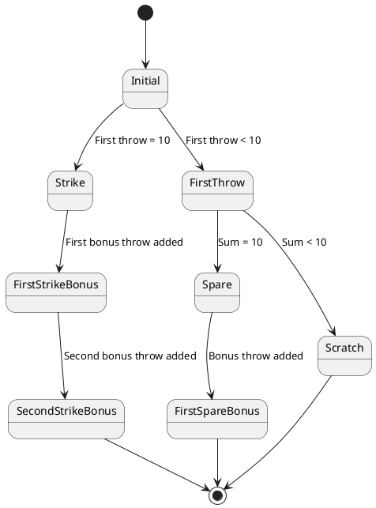

# Bowling OSM

The governing body for bowling in the US is the United States Bowling Congress ([USBC](https://bowl.com)). For
international play, game play is regulated by the International Bowling Federation ([IBF](https://bowling.sport)).
The defition of scoring and game play defined by both organizations are are equivalent. I will reference
the USBC's [standard for scoring a game of bowling](./assets/ScoreHowto.2024-11-11.pdf) as the "standard" implemented
in this project.

In a game of bowling a single player rolls a ball down a flat surface multiple times, repeatedly trying to knock
down a set of 10 pins set up in a triangular configuration.
The player's rolls, known as "throws", are grouped into frames. The scoring description is notable for having several odd
corner-cases and a quirky game termination, where the tenth and final frame is described as having a different set of
throws as the initial 9 frames.

Most of the oddness of the scoring algorithm arises from the game scorecard, which is a tool for human recording and
scoring. This is reminiscent of the confusion that arises from visualizations humans use for arithetic long division
and multi-digit multiplication, where number positioning and alignment on a piece of paper are paramount to algorithmic
success.

The essence of the scoring algorithm is actually pretty easy to understand, even if not easy to record cleanly on
a single piece of paper. The scorecard design is meant to standardize the method of scoring while keeping the amount
of paper needed for a human to keep score to a minimum.

This is a simpler description of how bowling score works:

* Each frame is scored separately
* The total game score is the sum of 10 sequential frame scores
* In each frame the player is given up to two normal throws to knock down 10 pins
* If the player knocks down all 10 pins in one throw (a "strike"), the player is awarded two bonus throws and fresh
  set of 10 pins
  * in this case the second normal throw in the frame is unused
  * if the player knocks down all 10 bonus pins on his first bonus throw, the player gets another fresh set of 10
    pins for his second bonus throw
* If the player instead knocks down all 10 pins in 2 throws (a "spare"), the player is awarded a single bonus throw
  and a fresh set of 10 pins
* The bonus throws for each frame are identical to the normal throws of subsequent frames
  * For example, if all 10 pins are knocked down in the first throw of frame 1, then the first normal throw of
    frame 2 is also the first bonus throw of frame 1
* An illegal throw is known as a "foul", and is recorded and scored as if zero pins were knocked down in that throw
* It is also a common tradition to record when a first normal throw creates a "split"; that is, if the pins left standing
  after the first throw are in specific configurations. This does not affect the score total, but is recorded on the game
  scorecard.

> Note that the 10th frame has no subsequent frames. Any bonus throws in the tenth frame are not identical to normal throws
> in subsequent frames because there are no subsequent frames.

## A Throw

There are two normal throws within each frame. In the case of a strike the second throw will be unused. Otherwise both
throws are used. Prior to a throw taking place, we can call the throw "incomplete", meaning it has yet to happen. I define several convenience constants for foul, unused, strike, and incomplete throws.

### BitVectors to represent pins combinations

We avoid using `integer` to record the throw result. A finite-valued type is preferable to an infinitely-valued type, because
we will be quantifying over the pins knocked down to define special rules for strikes and spares. Smtlib2 conveniently
defines finite-valued `bitvector` types [^1]. We represent a set of standing pins by a 10-bit bitvector: leading pin is
numbered `0`, the second rank of pins are numbered {1, 2} from left to right, the third rank of pins are numbered
`{3, 4, 5}` from left to right, and so on. A false value represents a pin that is knocked down, and a true value is
a standing pin. (Standard bowling uses a 1-based numbering scheme, but `smtlib2` bitvectors are 0-based.)

A "strike" is all 10 pin knocked down: `#b0000000000`. (`#b`_`nnnnn...`_ is a static representation of a bitvector)

### Explicit definition of all known split combinations

The USBC and IBF definitions of a "split" are rule-based, and can be succinctly defined as

> A setup of pins remaining standing after the first delivery, where the headpin is down and at least two
> pins remain standing, with one or more intermediate pins down, creating a gap.”

The most onerous "7-10" split in our representation would be `#b0000001001`.

We define a function `is-split-pins` from an explicit list of split constants, which is the most efficient implementation
for SMT solvers to reason with.

```
(define-fun is-split-pins ((pins (_ BitVector 10))) Bool
  (or
    (= #b0000001001 pins)
    (= #b0001001001 pins)
    ... ))
```

### Definition of a single _valid_ throw

Here's is the unconstrained definition of a `Throw`:

```
(declare-datatype Throw (
  (throw
    (pins (_ BitVector 10))
    (foul Bool)
    (unused Bool)
    (incomplete Bool))))

(define-const foul-throw Throw
  (throw #b0000000000 true false false))

(define-const unused-throw Throw
  (throw #b0000000000 false true false))

(define-const incomplete-throw Throw
  (throw #b0000000000 false false true))

```

A _valid_ throw is going to conform to one of these three rules:

* it is one of {`foul-throw`, or `unused-throw`, `incomplete-throw`}
* it has none of the `foul`, `unused` or `incomplete` flags set

```
(define-fun throw.is-valid ((t Throw)) Bool
  (or
    (= foul-throw t)
    (= unused-throw t)
    (= incomplete-throw t)
    (and
      (not (foul t))
      (not (unused t))
      (not (incomplete t)))))
```

## A Frame 

A frame consists of two normal throws and two bonus throws. Each frame goes through its own state sequence.

In a frame's initial state, all throws are incomplete. As individual valid throws are added in to a frame, the frame will proceed through one of three workflow paths:

* **a strike frame**. The frame's workflow terminates with the first normal throw a strike, the second normal throw
  unused, and both bonus throws used (ie, not unused)
* **a spare frame**. The frame's workflow terminates with both normal throws used and with all pins knocked down, the
  first bonus throw not unused and the second bonus throw unused.
* **a scratch frame**. The frame's workflow terminates with both noraml throws used and with not all pins knocked down,
  and both bonus throws unused.



The `Frame` datatype includes:
* two normal throw members
* two bonus throw members

I've also defined a convenience constant for an "empty" frame: a frame with no throws applied at all

```
(declare-datatype Frame (
  (frame
    (throw_1 Throw)
    (throw_2 Throw)
    (bonus_1 Throw)
    (bonus_2 Throw)))

(define-const empty-frame Frame
  (frame
    incomplete-throw      ; throw_1
    incomplete-throw      ; throw_2
    incomplete-throw      ; bonus_1
    incomplete-throw))    ; bonus_2
```

There are a lot of validation rules for a frame. I have included a written description of the rules in the
source code to help explain what the `smtlib2` logic implements.

```
;;;;
;; Validation rules for frames:
;; - the member throws must be valid
;; - the pins knocked down by throws must be consistent
;;   - the same pin can't be knocked down in the first and second normal throws
;;   - unless the first bonus throw is a strike, the same pin can't be knocked down in the
;;     first and second bonus throw
;; - one of the following rules must be met, which ensure consistency for scratch, strike, and spare frames
;;   - all 4 throws in the frame are incomplete
;;   - throw 1 is a strike and throw 2 is unused; both bonus throws are not unused
;;   - throw 1 is a not strike and throw 2 is incomplete; bonus 1 and bonus 2 are also incomplete
;;   - throw 1 is not a strike, throw 2 is not incomplete and together throw 1 and throw 2 form a spare; bonus 1
;;     is not unused and bonus 2 is unused
;;   - throw 1 is not a strike and together throw 1 and throw 2 form a scratch (not a spare); bonus 1
;;     and bonus 2 are both unused 
;; - the throws must be in-order -- later throws cannot be completed before earlier throws within the same frame
;;   - if second regular throw is complete then the first regular throw is also complete
;;   - if the first bonus throw is complete the the second regular throw is also complete
;;   - if the second bonus throw is complete then either
;;     - the first regular throw is complete and not a strike
;;     - OR the first regular throw is a strike and the first bonus throw is also complete
;;;;
```

> Note that where it says a throw is "not unused" above this means the throw is not incomplete and not unused.

All these validation rules are individually encoded in helper validation functions, which are all either directly
or indirectly referenced by `frame.valid`:

```
(define-fun frame.valid ((f Frame)) Bool
  (and
    (frame.valid.member-throws-valid f)
    (frame.valid.throw-pins-consistency f)
    (frame.valid.throw-mark-consistency f)
    (frame.valid.throws-in-order f)))
```

The state diagram above implies there are at least 8 distinct valid states a single frame can be in. This one validation
function will be `true` if a frame is in any one of these 8 states and the frame doesn't conflict with any of the
state's rules. Otherwise it will be false.

Note that the frame's validation includes ensuring the frame's throws are completed in order. It would be invalid
for a bonus throw to be completed before one of the normal throws, for example.

## Operation to Apply a Single Throw to a Frame

The frame workflow diagram above illustrates how a frame may proceed from initially empty state to completed state through
the application of different types of throws to the frame. For example, if you apply a strike to an empty frame, the frame
proceeds to what's labeled the "Strike" state.

The `Frame.ApplyThrowOp` operation datatype represents the transition of a frame from one state to another in this diagram.
An operation value is comprised of three values:
* **`throw`** the throw being applied to the frame
* **`prior_frame`** the frame prior to the throw application
* **`post_frame`** the frame after the throw application

```
(declare-datatype Frame.ApplyThrowOp (
  (frame.apply-throw-op
    (prior_frame Frame)
    (post_frame Frame)
    (throw Throw))))
```

The frame operation validation function ensures that the prior and post frames are related to each other strictly in
accordance with the bowling scoring algorithm. The comments in the `frame-ops.smt2` describe the frame operation
validation rules encoded by the validation function:

```
;;;;
;; In order to be a _valid_ frame throw application, the following rules must be satisfied:
;; - the prior frame must be valid
;; - the post frame must be valid
;; - the throw must be valid a not incomplete and not unused
;; - and one of these rules must be satisfied
;;   - prior frame throw_1 is incomplete and
;;     - post frame throw_1 is equal to the operation's throw
;;     - it is necessary to initialize throw_2 and the bonus throws in the post frame
;;       - if post frame is not a strike, post frame throw_2 and bonus_1 are incomplete, and bonus_2 is unused
;;       - if post frame is a strike, post frame bonus_1 and bonus_2 are incomplete, and throw_2 is unused
;;   - prior frame throw_1 is not incomplete, prior frame throw_2 is incomplete and
;;     - post frame throw_2 is equal to the operation's throw and
;;     - post frame throw_1 and prior frame throw_1 are equal
;;     - it is necessary to initialize the bonus throws in the post frame
;;       - if post frame is a spare, post frame bonus_1 is incomplete
;;       - if post frame is not a space, bonus_1 is unused
;;   - prior frame throw_1 and throw_2 are not incomplete, and bonus_1 is incomplete
;;     - post frame throw_1 and throw_2 are equals to prior the same prior frame fields
;;     - post frame bonus_1 is equal to the operation's throw
;;     - post frame bonus_2 is equal to prior frame's bonus_2 field
;;   - prior frame throw_1, throw_2 and bonus_1 are not incomplete, and bonus_2 is incomplete
;;     - post frame throw_1, throw_2, and bonus_1 are equal to prior the same prior frame fields
;;     - post frame bonus_2 is equal to the operation's throw
;;
;; You cannot create a valid frame throw application operation with prior and post frames in any other states.
;;;;
```

The task of entangling one frame's bonus throws with subsequent frames' normal throws is done by game validation rules.

## A Game

A game is comprised of 10 frames. There are also functions for computing a game's score and deducing
whether or not the game is incomplete. We also define a convenience constant representing an empty game:

```
(declare-datatype Game (
  (game
    (frame_1 Frame)
    (frame_2 Frame)
    (frame_3 Frame)
    (frame_4 Frame)
    (frame_5 Frame)
    (frame_6 Frame)
    (frame_7 Frame)
    (frame_8 Frame)
    (frame_9 Frame)
    (frame_10 Frame)))

(define-const empty-game Game
  (game
    empty-frame      ; frame_1
    empty-frame      ; frame_2
    empty-frame      ; frame_3
    empty-frame      ; frame_4
    empty-frame      ; frame_5
    empty-frame      ; frame_6
    empty-frame      ; frame_7
    empty-frame      ; frame_8
    empty-frame      ; frame_9
    empty-frame))    ; frame_10
```

> Note that I've opted to use an expicit set of fields, one for each frame, instead of an array or list. Using an array
> with an integer index key I felt like might require using quantifiers (`forall` or `exists`) over the infinite `Int`
> datatype. We avoid quantifying over infinite types whenever possible, because SMT solvers don't perform well
> when quantifying over infinite types. A list implies recursion, something SMT solvers also aren't great at (at
> least not as of the time I am writing this monograph).
>
> There's a downside to this: voluminous detailing of inter-frame relationships. There's no implied
> successor/succeeding relationship between the individual frame fields. So when detailing the relationships between
> frames you have to explicitly list out these relationships. See note below in the next section regarding the
> function to apply a throw to a game, which requires an explicit listing of inter-frame relationships in
> an operation validation function.

The game validation function "entangles" the states of the individual frames. This is where the bonus throws from
prior frames are defined to be equal to the normal throws of subsequent frames. The general rules entangling a frame
with the subsequent frame are relatively simple to state:

- if a frame is a mark (strike or spare), then the frame's first bonus throw is equal to the subsequent frame's first normal
  throw
- furthermore, if the frame is a strike AND the next frame is NOT a strike, then the frame's second bonus throw is
  equal to the subsequent frame's second normal throw
- furthermore, if the frame is a strike AND the next frame is ALSO a strike, then the frame's second bonus throw is
  equal to the subsequent frame's first bonus throw

We must explicitly define this relationship between each game's frames 1 and 2, and also between each game's frames 2 and 3,
and so on, all the way to frames 9 and 10. Frame 10 has no further entanglements, because there is no frame after frame 10.

Notice how subsequent frame states are automatically entangled by the logic. For example, if a frame is a spare then
the `bonus_1` of the frame must be equal to `throw_1` of the subsequent frame. This is how normal frame throws are
distributed to previous "mark" frames (strikes or spares) as bonuses.

If two frames in a row are strikes, then the first frame's bonus_2 is equal to the second frame's bonus_1, which in turn
is equal to the _next_ frame's throw_1 (by application of the same rules).

The `game.valid` function encode these rules by referencing helper validation functions. Check out `game.smt2` to see
the individual rule validation functions.

## Applying a Single Throw to a Game

A game's state sequence is pretty simple: a game begins in the "empty" state, where all frames are incomplete. Throws
are applied to the game, which in turn applies the throws to each individual frame, in sequence until each frame
is no longer incomplete. The game concludes when there are no more incomplete frames -- when frame 10 is complete,
the game is done.

A `Game.ApplyThrowOp` datatype represents the application of a single throw to a game. The datatype includes a
prior game state, a post game state, and the throw being applied to the game. A valid throw application requires
a valid `Frame.ApplyThrowOp`, which defines the application of the throw to the first incomplete frame in the
game.

I define how to apply the throw to the first incomplete frame using a large disjunction ("or"):

- if frame 1 is incomplete, apply the throw to frame 1.
  - That is: Frame 1 in the prior game state is the prior frame of a `Frame.ApplyThrowOp`, and frame 1 in the
    post game state is equal to the post game of the same `Frame.ApplyThrowOp`. Frames 2-10 in the prior game state
    or equal to frames 2-10 in the post game state.
- if frame 1 is complete and frame 2 is incomplete, apply the throw to frame 2.
  - See logic above -- use similar logic to apply the throw to frame 2 using a `Frame.ApplyThrowOp`. Frame 1 and frames
    3-10 in the prior game state are equal to frames 1 and 3-10 in the post game state.
- if frame 2 is complete and frame 3 is incomplete, apply the throw to frame 3 similarly
- if frame 3 is complete and frame 4 is incomplete, apply the throw to frame 4 similarly
- etc.

There alsoa validation rule that guarantees game frames are completed in order. Frame 2 can't be complete if frame 1
isn't complete. Frame 3 can't be complete if frame 2 isn't complete. And so on.

----

[^1] SMT solver's include are S**A**T solvers (boolean network solvers). SMT solvers inherit very efficient boolean and
    bitvector heuristics, as well as convenient syntax for representing bitvector values.