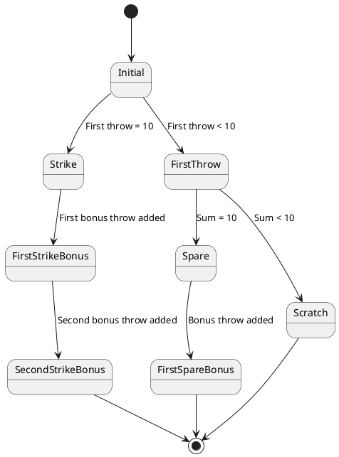

# Bowling OSM

The governing body for bowling in the US is the United States Bowling Congress ([USBC](https://bowl.com)). For
international play, game play is regulated by the International Bowling Federation ([IBF](https://bowling.sport)).
The defition of scoring and game play defined by both organizations are are equivalent. I will reference
the USBC's [standard for scoring a game of bowling](./assets/ScoreHowto.2024-11-11.pdf) as the "standard" implemented
in this project.

In a game of bowling a single player rolls a ball down a flat surface multiple times, repeatedly trying to knock
down a set of 10 pins set up in a triangular configuration.
The player's rolls, known as "throws", are grouped into frames. The scoring description is notable for having several odd
corner-cases and a quirky game termination, where the tenth and final frame is described as having a different set of
throws as the initial 9 frames.

Most of the oddness of the scoring algorithm arises from the game scorecard, which is a tool for human recording and
scoring. This is reminiscent of the confusion that arises from visualizations humans use for arithetic long division
and multi-digit multiplication, where number positioning and alignment on a piece of paper are paramount to algorithmic
success.

The essence of the scoring algorithm is actually pretty easy to understand, even if not easy to record cleanly on
a single piece of paper. The scorecard design is meant to standardize the method of scoring while keeping the amount
of paper needed for a human to keep score to a minimum.

This is a simpler description of how bowling score works:

* Each frame is scored separately
* The total game score is the sum of 10 sequential frame scores
* In each frame the player is given up to two normal throws to knock down 10 pins
* If the player knocks down all 10 pins in one throw (a "strike"), the player is awarded two bonus throws and fresh
  set of 10 pins
  * in this case the second normal throw in the frame is unused
  * if the player knocks down all 10 bonus pins on his first bonus throw, the player gets another fresh set of 10
    pins for his second bonus throw
* If the player instead knocks down all 10 pins in 2 throws (a "spare"), the player is awarded a single bonus throw
  and a fresh set of 10 pins
* The bonus throws for each frame are identical to the normal throws of subsequent frames
  * For example, if all 10 pins are knocked down in the first throw of frame 1, then the first normal throw of
    frame 2 is also the first bonus throw of frame 1
* An illegal throw is known as a "foul", and is recorded and scored as if zero pins were knocked down in that throw
* It is also a common tradition to record when a first normal throw creates a "split"; that is, if the pins left standing
  after the first throw are in specific configurations. This does not affect the score total, but is recorded on the game
  scorecard.

> Note that the 10th frame has no subsequent frames. Any bonus throws in the tenth frame are not identical to normal throws
> in subsequent frames because there are no subsequent frames.

## A Throw

There are two normal throws within each frame. In the case of a strike the second throw will be unused. Otherwise both
throws are used. Prior to a throw taking place, we can call the throw "incomplete", meaning it has yet to happen. I define several convenience constants for foul, unused, strike, and incomplete throws.

### BitVectors to represent pins combinations

We avoid using `integer` to record the throw result. A finite-valued type is preferable to an infinitely-valued type, because
we will be quantifying over the pins knocked down to define special rules for strikes and spares. Smtlib2 conveniently
defines finite-valued `bitvector` types [^1]. We represent a set of standing pins by a 10-bit bitvector: leading pin is
numbered `0`, the second rank of pins are numbered {1, 2} from left to right, the third rank of pins are numbered
`{3, 4, 5}` from left to right, and so on. A false value represents a pin that is knocked down, and a true value is
a standing pin. (Standard bowling uses a 1-based numbering scheme, but `smtlib2` bitvectors are 0-based.)

A "strike" is all 10 pin knocked down: `#b0000000000`. (`#b`_`nnnnn...`_ is a static representation of a bitvector)

### Explicit definition of all known split combinations

The USBC and IBF definitions of a "split" are rule-based, and can be succinctly defined as

> A setup of pins remaining standing after the first delivery, where the headpin is down and at least two
> pins remain standing, with one or more intermediate pins down, creating a gap.”

The most onerous "7-10" split in our representation would be `#b0000001001`.

We define a function `is-split-pins` from an explicit list of split constants, which is the most efficient implementation
for SMT solvers to reason with.

```
(define-fun is-split-pins ((pins (_ BitVector 10))) Bool
  (or
    (= #b0000001001 pins)
    (= #b0001001001 pins)
    ... ))
```

### Definition of a single _valid_ throw

Here's is the unconstrained definition of a `Throw`:

```
(declare-datatype Throw (
  (throw
    (pins (_ BitVector 10))
    (foul Bool)
    (unused Bool)
    (incomplete Bool))))

(define-const foul-throw Throw
  (throw #b0000000000 true false false))

(define-const unused-throw Throw
  (throw #b0000000000 false true false))

(define-const incomplete-throw Throw
  (throw #b0000000000 false false true))

```

A _valid_ throw is going to conform to one of these three rules:

* it is one of {`foul-throw`, or `unused-throw`, `incomplete-throw`}
* it has none of the `foul`, `unused` or `incomplete` flags set

```
(define-fun throw.is-valid ((t Throw)) Bool
  (or
    (= foul-throw t)
    (= unused-throw t)
    (= incomplete-throw t)
    (and
      (not (foul t))
      (not (unused t))
      (not (incomplete t)))))
```

## A Frame 

A frame consists of two normal throws and two bonus throws. Each frame goes through its own state sequence.

In a frame's initial state, all throws are incomplete. As individual valid throws are added in to a frame, the frame will proceed through one of three workflow paths:

* **a strike frame**. The frame's workflow terminates with the first normal throw a strike, the second normal throw
  unused, and both bonus throws used (ie, not unused)
* **a spare frame**. The frame's workflow terminates with both normal throws used and with a sum of points totalling
  10, the first bonus throw used and the second bonus throw unused.
* **a scratch frame**. The frame's workflow terminates with both noraml throws used and with a sum of points totalling
  less that 10, and both bonus throws unused.



The `Frame` datatype includes:
* two normal throw members
* two bonus throw members
* some flags to make deduction easier (strike, spare, and incomplete)
* total points of the frame, which is the sum of the 4 throws

I've also defined a convenience constant for an "empty" frame: a frame with no throws applied at all

```
(declare-datatype Frame (
  (frame
    (throw_1 Throw)
    (throw_2 Throw)
    (bonus_1 Throw)
    (bonus_2 Throw)
    (strike Bool)
    (spare Bool)
    (points Int)
    (incomplete Bool))))

(define-const empty-frame Frame
  (frame
    incomplete-throw      ; throw_1
    incomplete-throw      ; throw_2
    incomplete-throw      ; bonus_1
    incomplete-throw      ; bonus_2
    false                 ; strike flag
    false                 ; spare flag
    0                     ; points
    true)                 ; incomplete flag)
```

There are a lot of validation rules for a frame. I have included a written description of the rules in the
source code to help explain what the `smtlib2` logic implements.

```
;;;;
;; Validation rules for frames:
;; - the member throws must be valid
;; - the frame is incomplete iff any of the the throws are incomplete
;; - the frame's score is consistent with the sum of the throw scores iff the frame is complete
;; - the throws must be in-order -- later throws cannot be completed before earlier throws within the same frame
;;   - if second regular throw is complete then the first regular throw is also complete
;;   - if the first bonus throw is complete the the second regular throw is also complete
;;   - if the second bonus throw is complete then either
;;     - the first regular throw is complete and not a strike
;;     - OR the first regular throw is a strike and the first bonus throw is also complete
;; - one of the following rules as well
;;   - the frame is a valid strike frame
;;     - the strike flag is true
;;     - the spare flag is false
;;     - the first throw is a strike
;;     - the second throw is unused
;;     - the first and second bonus throws are not unused
;;   - the frame is a valid spare frame
;;     - the strike flag is false and the spare flag is true
;;     - the first and second throws are not incomplete, and the first throw is not a strike throw
;;     - the sum of the first and second throws is 10
;;     - the second regular throw and the first bonus throw are not unused
;;     - the second bonus throw is unused
;;   - the frame is a valid scratch frame
;;     - the strike and spare flags are false
;;     - the sum of the point values of the first and second throws is less than 10
;;     - the first and second throws are not unused
;;     - if first throw is incomplete, then the second bonus throw is incomplete, else the second bonus throw is unused
;;     - if the second throw is incomplete, then first bonus throw is incomplete, else the first bonus throw is unused
;;;;
```

> Note that where it says a throw is "not unused" above this means the throw is either complete or incomplete. So long
> as the `unused` flag is not `true`, the throw is not unused.

All these validation rules are individually encoded in helper validation functions, which are all either directly
or indirectly referenced by `frame.validation`:

```
(define-fun frame.validation ((f Frame)) Bool
  (and
    (frame.validation.member-throws-valid f)
    (frame.validation.frame-complete-consistent-with-throws f)
    (frame.validation.score-consistent-with-throws f)
    (frame.validation.throws-in-order f)
    (or
      (frame.validation.is-valid-strike-frame f)
      (frame.validation.is-valid-spare-frame f)
      (frame.validation.is-valid-scratch-frame f))))
```

The state diagram above implies there are at least 8 distinct valid states a single frame can be in. This one validation
function will be `true` if a frame is in any one of these 8 states and the frame doesn't conflict with any of the
state's rules. Otherwise it will be false.

Note that the frame's validation includes ensuring the frame's throws are completed in order. If would be invalid
for a bonus throw to be completed before one of the normal throws, for example.

## Operation to Apply a Single Throw to a Frame

The frame workflow diagram above illustrates how a frame may proceed from initially empty state to completed state through
the application of different types of throws to the frame. For example, if you apply a strike to an empty frame, the frame
proceeds to what's labeled the "Strike" state.

The `Frame.ApplyThrowOp` operation datatype represents the transition of a frame from one state to another in this diagram.
An operation value is comprised of three values:
* **`throw`** the throw being applied to the frame
* **`prior_frame`** the frame prior to the throw application
* **`post_frame`** the frame after the throw application

```
(declare-datatype Frame.ApplyThrowOp (
  (frame.apply-throw-op
    (prior_frame Frame)
    (post_frame Frame)
    (throw Throw))))
```

The frame operation validation function ensures that the prior and post frames are related to each other strictly in
accordance with the bowling scoring algorithm. The comments in the `frame-ops.smt2` describe the frame operation
validation rules encoded by the validation function:

```
;;;;
;; In order to be a _valid_ frame throw application, the following rules must be satisfied:
;; - the prior frame must be valid
;; - the post frame must be valid
;; - the throw must be valid a not incomplete and not unused
;; - and one of these two rules must be satisfied
;;   - prior frame throw_1 is incomplete and
;;     - post frame throw_1 is equal to the operation's throw
;;     - it is necessary to initialize throw_2 and the bonus throws in the post frame
;;       - if post frame is not a strike, post frame throw_2 and bonus_1 are incomplete, and bonus_2 is unused
;;       - if post frame is a strike, post frame bonus_1 and bonus_2 are incomplete, and throw_2 is unused
;;   - prior frame throw_2 is incomplete and
;;     - post frame throw_2 is equal to the operation's throw and
;;     - post frame throw_1 and prior frame throw_1 are equal
;;     - it is necessary to initialize the bonus throws in the post frame
;;       - if post frame is a spare, post frame bonus_1 is incomplete
;;       - if post frame is not a space, bonus_1 is unused
;;;;
```

There's a lot of twisty-turny logic in there. That's just how the bowling algorithm is. The full implementation of
this logic is in the `frame.apply-throw-op.validation` function in `frame-ops.smt2`, which I won't repeat here because
its a bit of an eyeful for casual perusal.

## A Game

A game is comprised of 10 frames, an `incomplete` flag, and a `score`. I also define a convenience
constant representing an empty game:

```
(declare-datatype Game (
  (game
    (frame_1 Frame)
    (frame_2 Frame)
    (frame_3 Frame)
    (frame_4 Frame)
    (frame_5 Frame)
    (frame_6 Frame)
    (frame_7 Frame)
    (frame_8 Frame)
    (frame_9 Frame)
    (frame_10 Frame)
    (incomplete Bool)
    (score Int))))

(define-const empty-game Game
  (game
    empty-frame      ; frame_1
    empty-frame      ; frame_2
    empty-frame      ; frame_3
    empty-frame      ; frame_4
    empty-frame      ; frame_5
    empty-frame      ; frame_6
    empty-frame      ; frame_7
    empty-frame      ; frame_8
    empty-frame      ; frame_9
    empty-frame      ; frame_10
    true             ; incomplete flag
    0)               ; score)
```

> Note that I've opted to use an expicit set of fields, one for each frame, instead of an array or list. Using an array
> with an integer index key I felt like might require using quantifiers (`forall` or `exists`) over the infinite `Int`
> datatype. I try to avoid doing that when possible, because SMT solvers don't perform consistently with quantifying
> over infinite types. A list implies recursion, something SMT solvers also aren't great at (at least not as of the
> time I am writing this monograph).
>
> There's a downside to this: voluminous detailing of inter-frame relationships. There's no implied
> successor/succeeding relationship between the individual frame fields. So when detailing the relationships between
> frames you have to explicitly list out these relationships. See note below in the next section regarding the
> function to apply a throw to a game also, which requires a very drawn-out listing of inter-frame relationships in
> an operation validation function.

The game validation function "entangles" the states of the individual frames. This is where the bonus throws from
prior frames are defined to be equal to the normal throws of subsequent frames. The comments within `game.smt2`
describe the full set of rules for a _valid_ game:

```
;;;;
;; A valid game is comprised of valid frames. The state of sequential the frames are entangled.
;; - The frames are completed sequentially; if frame X has either regular throw incomplete, then frame X+1 is
;;   is the empty-frame -- this rule applies to frames 1-9
;; - For member frames that are "mark" frames (strike or spare):
;;   - The first bonus throw is equal to the first normal throw of the next frame -- this rule applies to frames 1-9
;; - For member frames that are strike frames and the next frame is _not_ a strike frame
;;   - the second bonus throw is equal to the second normal throw of the next frame -- this rule applies to frames 1-9
;; - For member frames that are strike frames and the next frame is also a strike frame
;;   - the second bonus throw is equal to the first bonus throw of the next frame, which is also equal to the
;;     first normal throw of the second frame seqentially forward, because of the "mark" frame rule above -- this rule
;;     applies to frames 1-9
;; - The game's incomplete flag is consistent with the completion state of the 10th frame; the game is complete when the
;;   10th frame is complete
;; - The score is the sum of the point values of all the frames
;;;;
```

Notice how subsequent frame states are automatically entangled by the logic. For example, if a frame is a spare then
the `bonus_1` of the frame must be equal to `throw_1` of the subsequent frame. Not just the point values equal, but the
entire throw. This is how normal frame throws are distributed to previous "mark" frames (strikes or spares) as bonuses.

Each of these rules is individually encoded in rule-specific validation functions, which are referenced
directly or indirectly from the `game.validation` function. Check out `game.smt2` to see the individual rule validation
functions. Here's `game.validation`, which simply esures all the individual rule functions are satisfied:

```
(define-fun game.validation ((g Game)) Bool
  (and
    (game.validation.member-frames-valid g)
    (game.validation.sequential-frames g)
    (game.validation.mark-frames-first-bonus-consistency-with-next-throw g)
    (game.validation.strike-then-not-strike-bonus-2-consistency g)
    (game.validation.strike-then-strike-bonus-2-consistency g)
    (game.validation.completion-consistent-with-frame-10 g)
    (game.validation.score-consistent-with-frames-point-total g)))

```

## Applying a Single Throw to a Game

----

[^1] SMT solver's include are S**A**T solvers (boolean network solvers). SMT solvers inherit very efficient boolean and
    bitvector heuristics, as well as convenient syntax for representing bitvector values.