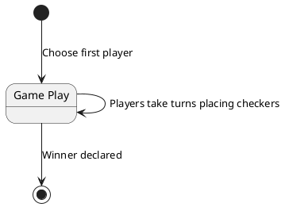

# Connect Four

[Connect Four](https://en.wikipedia.org/wiki/Connect_Four) is a simple table-top strategy game, originally created by Howard
Wexler and sold by Milton Bradley. The game is played on a vertical 6 row by 7 column board. Players first choose a color
(red or black), and then choose a first player. Players take turns placing a single colored marker on the board. Game play
continues until one player wins by placing 4 of their markers in a continuous row, column, or diagonal configuration, or until
a draw occurs when there are no more valid plays.

A player places a marker by picking a column. The piece "falls" to the lowest unoccupied position in the column. If the column is full
then it cannot be played. Thus each player has at most 7 possible plays in each turn -- one for each column.

## OSM Model

### Domain model

The game state is represented by a 6x7 matrix of _`Coordinate`_ values. Each `Coordinate` has a
`RowId` and `ColId` value -- which are _not_ integers, but rather a custom value type. We use an array as a "look up table" to
define adjacency sufficient to determine when 4 pieces have been place in a row. (See [formula/main/row-col.smt2](formula/main/row-col.smt2).)

The `color` value of each coordinate is `red`, `black`, or `neutral`. (See [formula/main/color.smt2](formula/main/color.smt2).)

A `Board` is comprised of:

* a 6x7 array of `Coordinate` to `Color` values, called the `table`
* a `current-player` color value. During the initial game ceremony of choosing a first player, the `current_player` value
  is `neutral`. Once a player is chosen, then the player color alternates between `Red` and `Black` each turn.
* a `winner` color value. This value remains `neutral` until a winner is declared.

(See [formula/main/board.smt2](formula/main/board.smt2).)

### Operation-states



All operations are encoded in [./formula/main/board-ops.smt2](formula/main/board-ops.smt2).

There is one operation for **choosing a first player** (the `board-ops.choose-first-player` function). This operation application is the
first of a valid game sequence, and is the only time this operation is applied during the valid game sequence.

There are just 2 more operations in the game:

* **Player turn** (the `board-ops.player-turn` function). A checker the same color as the current player is placed in a coordinate with a `neutral` value. Additional
  rule guarantees the checker "falls" to the lowest unoccupied position in its column. The final state of the board after
  application of this operation switches the current player from `red` -> `black` or vice versa.

* **Declare winner** (the `board.declare-winner` function). The initial game state for this operation is any `Board` where the
  `winner` value is `neutral`. The operation input also includes a root coordinate and a direction (horizontal, vertical, diagonal down-right or diagonal down-left). The table positions indicated by the root coordinate an the direction must have a sequence of
  4 checkers of the same color as the declared winner. The final `Board` state after successful application of this operation has
  `winner` value set to the color of the winning player.

## Notes

### On Not Using Integers as Indexes

Instead of using integers to index columns and rows, this model uses `ColId` and `RowId` custom datatypes to define
positions within the table. Integers _seem_ like the right choice to the software-engineer side of my brain. Why not
number the rows 1-6 the columns 1-7? There's a good reason not to: simply because SMT solvers don't reason well with
infinite types, such as Integer.

Consider the rule that there are no "floating" checkers on a Connect Four table. That is, when a player "drops" a piece
into a column, under the force of gravity the piece falls to the lowest position. The way a software engineer would code
this logic would be in a for-comprehension (a for loop), or recursively:

1. Starting with the highest row test whether or not the _next lowest_ position has `neutral` color, which indicates it
   is unoccupied.
1. If the next lowest row is _not_ occupied, then decrement the "current row" value, and start again with step 1.
1. If the next lowest row _is_ occupied, then the current row is the lowest position that is unoccupied -- this is
   there the piece should go.

(I'm deliberately eliding the condition where the whole column is occupied for the sake of brevity.)

But SMTLIB2 solvers don't reason recursively, and there is no for-loop construct in SMTLLIB2. Instead we have the
_universal quantifier_ logical statement. This statement verifies a predicate is true for _all_ members of a type. One
could try writing the "no floating checkers" rule like so:

* for all valid game boards _b_, and all table (row, column) coordinates (_r_, _c_):
    * IF the position at (_r_, _c_) in _b_'s table is occupied, THEN _r_ must be 1 OR the position at (_r_-1, _c_) is also occupied

This production perfectly states the rule that no "floating" checkers exist in any valid game board.

**However**, SMT solvers can't prove statements like this. The issue is that the domain of the quanitifier is infinite. The domain
is all possible combinations of a game board and integer coordinate pairs. The size of this domain is (Board x Integer x Integer),
which is infinite. An SMT solver is not going to be able to prove this statement is true across the infinite domain of all
possible boards and integers.

Of course we aren't really interested in _all_ integers. We're really only interested in row indexes 1-6 and column indexes 1-7. But
SMT solvers don't know that, so they try to prove the quanitifier across _all_ (Integer x Integer) pairs and across all posible board
combinations. The set of all possible boards is finite, but the set of all (Integer x Integer) pairs is infinite.

Instead of yielding a `sat` response when asked to prove this quanitifier, the best a solver can yield is `unknown`, meaning that
the domain is just too big for the SMT solver to cover exhaustively.

### Using Finitely-valued Types Instead

Instead of using Integers, we define a finite type called `Coordinate`, which only has 6x7=42 possible members. SMT solvers
have no problem exhaustively proving a predicate is true across 42 possible values.

There's some extra info we need to provide with the finite value types: the "above" relationships between rows. Integers
are attractive because they come with "previous" and "successor" relationships which software engineers instictively equate to "before"
and "after" relationships between indexes in arrays and matrices. Our custom enumerated types don't automatically have these
relationships so we have to create them.

There's another issue: logic for determining the coordinates of a sequence-of-4 positions on a table can be highly nested or
recursive. This will be true whether using Integer or our custom type as index types. Persnickety, repetitive logic tends to
confound SMT solvers -- these solvers are designed to avoiding repetative steps, preferring breadth-first as opposed to
depth-first search of the proof space. We greatly simplify the solver's job by precomputing all possible sequence-of-4 coordinate
tuples.

The Connect Four formula includes predefined arrays that associate each coordinate on the board with sequence-of-4 coordinates
in the horizontal, vertical, and diagonal directions (see `formula/main/winning.smt2`). These arrays are pretty voluminous. Most
software engineers are going to see the presence of huge structures like that in the codebase as a "code smell". Another option
would be to generate these arrays using pre-processor macros. (This is how C and C++ projects generate pre-compiled structures
that are wasteful or unnecessary to generate at runtime.) I've explicitly listed the arrays to keep the project simple, but in
a real-world project I'd lean on preprocessor macros to lighten the coding load.

## Example Initial Game Sequence

Here's the definition of the initial sequence of a game.

* The game begins in the `board.empty` state
* The result of the first operation application, `board.1`, is the result of picking the `red` player as the first player

```
#include "board-ops.smt2"
#include "board.smt2"
#include "color.smt2"
#include "row-col.smt2"


;;;;
;; board.1 is the valid result of choosing `red` as the first player from the empty board

(declare-const board.1 (Board))

(assert
  (board-ops.validation.choose-first-player
    (board-ops.choose-first-player
      board.empty            ;; before_board
      board.1                ;; after_board
      red)))                 ;; color of first player

;;;;
;; board.2 is the valid result of the `red` player placing the first piece in row a, column 3

(declare-const board.2 (Board))

(assert
  (board-ops.validation.player-turn
    (board-ops.player-turn
      board.1                ;; before_board
      board.2                ;; after_board
      (coord row_a col_3)))) ;; placement of checker

;;;;
;; board.3 is the valid result of the `black` player taking the next turn, placing the next piece in row b, column 3

(declare-const board.3 (Board))

(assert
  (board-ops.validation.player-turn
    (board-ops.player-turn
      board.2                ;; before_board
      board.3                ;; after_board
      (coord row_b col_3)))) ;; placement of checker

(check-sat)
```

This script is a query for verification that this exact sequence of 3 operations (_red player chosen to go first_, _play red col 3 row a_, _play black col 3 row b_) is _valid_ per the Connect Four rules.

If you run this script through a Z3 smt solver, the response will be `sat`, proving that this sequence is valid
and conforms to all the Connect Four rules.
