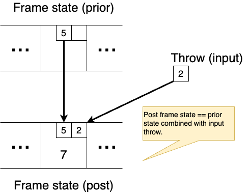
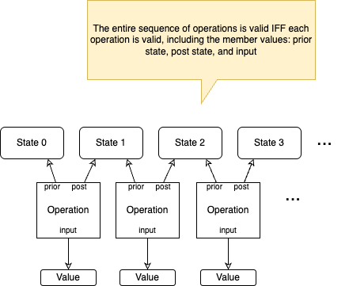

# osm-games

### The Problem

Software "specs" are not objectively verifiable. There's no mechanical, objective, repeatable way to prove a piece of software meets
a written "spec".

### The Solution

Operation-state modeling (OSM): a logical, verifiable description of system behavior

## This Repo

[The `osm-games` repo](https://github.com/bmaso/osm-games) is a demonstration of operation-state modeling (OSM, pronounced "awesome"). This repo defines operation-state models of a few
popular games: [Connect Four](./connect4), [bowling](./bowling), [backgammon](./backgammon), and [spades](./spades) (a card game).
It also demonstrates the tools and techniques for verifing a game sequence conforms to an OSM through the use of a type of software
known as an [_SMT solver_](https://en.wikipedia.org/wiki/Satisfiability_modulo_theories).

Table top and card games are just special cases of multi-party workflows. The intention of this repo is to show that OSM
is a practical technique for specifying complex, multi-party, and distributed system behavior -- really any process
that produces a sequence of state changes. The repo also demonstrates how to create software behavior validators out of
OSM descriptions using freely available tools.

## OSM Specs

This repo uses the [`smtlib2` language](https://smt-lib.org/language.shtml) to describe various game sequences from start to finish as a system of equations. `smtlib2` is
a Lisp-like language designed to express propositional logic, various math theories, and algebraic datatypes --
that is, equational math. Multiple freely available software packages, known as SMT solvers, read and automatically solve equational
systems written in `smtlib2`: [Z3 from Microsoft](https://www.microsoft.com/en-us/research/project/z3-3/) and
[CVC5](https://cvc5.github.io/) are two popular examples. An SMT solver makes OSM specs written in `smtlib2` usable [^1].
With an SMT solver we can:

- **Verify a game sequence, or _any_ workflow sequence, conforms to an operation-state model**. This is _the_ key goal of OSM.
  The problem OSM aims to solve stems from the fact that software "specs" are unverifiable. They are generally comprised of
  words and drawings, which sometimes are incredibly detailed (though often not). But there is no tool or mechanism on Earth able
  to objectively verify an implementation actually conforms to words and drawings, no matter how detailed. With OSM and an SMT solver,
  there's a way to specify expected behavior, and tools to prove observed behavior does not conflict with specification
  through an automated, objective, and repeatable mechanism.

- **Unambiguously answer novel and unanticipated questions about expected system behavior**. Using all the power of mathematical
  refactoring and symbolic logic, we can answer questions not detailed in a specification. Deriving answers to novel and
  unanticipated questions from a spec based on words and visualizations will typically require time-consuming and expensive
  human interactions, inconsistent reasoning, "judgement calls", authoritative dicta, and all the myriad intellectual transgressions
  that stem from using the spoken word. But a logical description of behavior can answer novel facts about the expectations of a
  system. Someone implementing the software package for scoring a game of bowling, for example, need not consult an "expert" to
  answer questions about the finer points of the game if he has an OSM model available.

- **Generate test data**. An exploitable feature of SMT solvers is that they are quite good at generating values for free variables
  in a system of equations. For example, given an equational description of bowling (which a bowling OSM is), one can direct an SMT
  solver to generate a complete valid game of bowling that includes a string of 3 strikes in successive frames. There's no need for
  a human to laboriously "make up" data that matches a specific test-case when such data is needed, so we can avoid this time-consuming
  and error prone part of software verification.

[OSM Models in `smtlib2`](./osm-specs-in-smtlib2/) covers the tool chains and techniques I employ for developing OSMs in `smtlib2`.

## Operation-state Models

An _operation-state model_ (OSM) equationally describes the valid states and state transitions of a finite-state system or process,
such as a table-top game. The description is comprised of:

- **A state model**. At any one point in time, the state of the system can be fully described by a single instance of the state model.
  A graph of algebraic data values with tuples as graph vectors forms a system's state.

    In the game of bowling, for example, individual _throws_ are groupled into _frames_, and _frames_ are grouped into a _game_.
    Each throw includes a count of _points_ and some additional flags, such as _foul_ and _split_. Every possible bowling game,
    at any point of play up to and including termination, is representable as an instance of this state model.

* **Operations**. The system proceeds through its lifecycle by the sequential application of atomic _operations_. An operation is simply a
  tuple that equationally relates a _prior state_ with a _post state_ (which are each instances of the state model), operation
  _input_ values, and soemtimes also operation _output_ values.

    In bowling there's only one type of operation: "apply throw". An apply throw operation value will be
    a tuple comprised of:

    * **a _prior game_**: the state of the game before the throw is applied
    * **a _post game_**: the state of the game after the throw is applied
    * and **a _throw_ value**: which is the throw that took the game from its prior state to its post state.

* **Validation logic**. These are logical, mathematical assertions that a) define _valid_ system state requirements
  in the form of invariant assertions on the system state data types; and b) cleanly define _valid_ operation applications by
  relating the operation input, prior state, and post state values. The OSM's system of equations relates the three operation
  values (prior state, post state, and operation input).

    In the game of bowling, for example, there are multiple assertions that distinguish a valid throw application from an invalid one:

    * two throws in the same frame can't knock the same pins down twice
    * the first bonus throw in from X is equal to the first normal throw of frame X+1 (a special scoring case for strikes and spares)
    * the frame and game total score in the post game state must reflect the number of pins knocked down by the throw
    * most importantly, a valid throw operation must reference a _valid_ prior game state, a _valid_ post game state, and
      a _valid_ throw

    The assertions are expressed as a set of predicate functions (ie, boolean statements) in the domain of game operations. Note that an
    _equation_ is actually a boolean statement: _if_ the left side of the equation is mathematically identical or reducible to the
    right side (or vice versa), _then_ the equation is "true"; _if_ the  left side of the equation is proveably non-identical to the
    right, _then_ the equation is "false". An OSM model expresses validation logic as a set of equations which must all be _true_ in
    order for an operation application to be valid.

    

    A game sequence is comprised of a chain of operation applications. Each operation application entangles a prior game state
    and a post game state. A prevous operation's post game state becomes the next operation's prior game state. Thus the game sequence
    is a chain of operation applications bound together by shared state instances, and is in fact simply a large system of equations.

    

    An OSM can also be thought of as an _operation sequence schema_, in the same way that a regex expression can be thought of as a
    _string schema_. A regex describes a class of _valid_ strings that conform to the regex's pattern. Similarly, the OSM describes a
    class of _valid_ operation application sequences (a type of DAG) that conform to the OSM.

The role of the SMT solver is to solve an OSM system of equations, where the various player's "moves" during game are the bound
values of the system's free variables. 

## Connect Four, Bowling, Backgammon, and Spades

The [bowling OSM example](./bowling) defines the game of bowling as a system of equations relating `Throw`, `Frame` and `Game`
algebraic datatypes, and the game process is defined by an "apply throw" operation comprised of those data constructs. I authored
the bowling example to be the premier OSM example in this repo. It is designed to mirror [the "Extreme Programming Episode"](https://sites.google.com/site/unclebobconsultingllc/uncle-bob-consulting-llc/articles/the-bowling-game-an-example-of-test-first-pair-programming)
by Robert Martin and Robert Koss, which has introduced generations of professional developer's to Test-Driven Development practices
since its publication some 20 years prior to the words you are reading now were written. As influential and entertaining as that piece
is, it's of some significance to recognize that the version of "bowling" that Martin & Koss develop during the "Episode" is in fact
_not in conformance with any standard version of "bowling"_. The reputational popularity of  Martin & Koss's episode, coupled with the
fact that it technically fails at its actual stated goal of scoring "a standard bowling card", makes the game of bowling a great
focus for the OSM demonstration [_An Equational Thinking Episode_](./bowling/OSM-Episode.md).

The [Connect Four OSM example](./connect4) is meant to be a gentle and yet non-trivial example of a game OSM. Connect Four is a
childrens' table-top game exhibiting very few constraints on a simple domain. The Connect Four OSM describes this game with
a single initial operation "choose first player", a repeated "played takes turn" operation, and a terminal "declare winner" operation.
The game model consists of just an array storing the "game table position" to "checker color" relationship, and a couple other
fields to store the current player and the winning player.

Studying the Connect Four OSM is a good way to get an introduction to `smtlib2`. Effectively representing a 6x7 2D game grid, for
example, is surprisingly different in `smtlib2`, a logical language, than in a traditional programming language.

The [backgammon OSM example](./backgammon) defines the game of backgammon as a system of equations relating `Point`, `Bar`, `DiceThrow`,
and `Board` algebraic datatypes. The game proceeds through "apply player turn" operations, which are comprised of these data constructs.
I included backgammon because it is a turn-based game with non-trivial rules for turn play, especially in cases where one player's pieces "block" the other's.

The [spades OSM example](./spades) defines the game of spades as a system of equations relating several algebraic datatypes, including
`Hand`, `Trick`, `Bid`, etc. Spades is a trick-playing card game played with 4 players arranged into teams. I consider this an interesting OSM game example for two reasons:

* the multiple phases each trick and each hand must pass through to complete a game make for an interesting study in game
  state representation
* the universe of card games is huge; laying down the mechanics of how to represent cards, hands, "dealing", and other
  common card game features opens up a wide set of non-trivial games to practice and perfect OSM techniques -- model contributions welcome!

[^1]: The dream of verifiable system definitions stretches back to the early days of commercial software. In 1974 Jean-Raymond Abrial
  published the _`Z`_ language (pronounced "zed"), a language for definiting system behavior using set theory and propositional logic,
  not completely unlike how OSMs describe behavior in `smtlib2`. The UML standard includes a logical verification language called the
  [Object Constraint Language](https://www.omg.org/spec/OCL/) (OCL), which is also very similar in overall concept. Finally made
  an official OMG standard in 2006, OCL originates in the early 1990s. These are just some better-known examples
  -- there are literally dozens of examples created and abandoned over the decades. None of these languages were _usable_, however,
  because the logical theorem provers available at the time were far too incapable of proving non-trivial specifications, or the
  systems simply never included theorem provers at all. Modern SMT solvers and modern computers finally have the "heft" to solve
  the kinds of problems necessary to prove system behavior conformance.

